# 【CSS浮动】

> 本文档是个人对 Pink 老师课程的总结归纳及补充，转载请注明出处！ 

# 一、浮动（float）

## 1.1 传统网页布局的三种方式

网页布局的本质：用 CSS 来摆放盒子，把盒子摆放到相应位置。

CSS 提供了三种传统布局方式（简单说就是盒子如何进行排列）。

- 普通流（标准流）
- 浮动
- 定位

> 这里指的只是传统布局，其实还有一些特殊高级的布局方式。

## 1.2 标准流（普通流/文档流）

所谓的标准流：就是标签按照规定好的默认方式排列。

1. **块级元素会独占一行，从上向下顺序排列。**
2. **行内元素会按照顺序，从左到右顺序排列，碰到父元素边缘则自动换行。**

以上都是标准流布局，我们前面学习的就是标准流，标准流是最基本的布局方式。

这三种布局方式都是用来摆放盒子的，盒子摆放到合适位置，布局自然就完成了。

**注意：**实际开发中，一个页面基本都包含了这三种布局方式（后面移动端学习新的布局方式） 。

## 1.3 为什么需要浮动？

提问：我们用标准流能很方便的实现如下效果吗？

1. **如何让多个块级盒子（div）水平排列成一行？**


比较难，虽然转换为行内块元素可以实现一行显示，但是他们之间会有大的**空白缝隙**，很难控制。

```html
<!doctype html>
<html lang="en">

<head>
    <meta charset="UTF-8">
    <meta http-equiv="X-UA-Compatible" content="IE=edge">
    <meta name="viewport" content="width=device-width, initial-scale=1.0">
    <title>行内块中间有缝隙</title>
    <style>
        div {
            width: 150px;
            height: 200px;
            background-color: #d87093;
            display: inline-block;
        }
    </style>
</head>

<body>
    <div>1</div>
    <div>2</div>
    <div>3</div>
</body>

</html>
```


2. **如何实现两个盒子的左右对齐？**

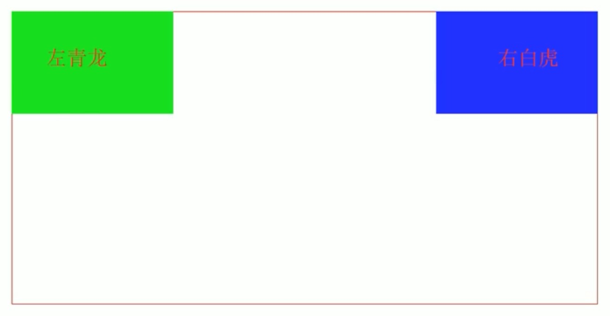

总结： 有很多的布局效果，标准流没有办法完成，此时就可以利用浮动完成布局。 因为浮动可以改变元素标签默认的排列方式。

**浮动最典型的应用：可以让多个块级元素一行内排列显示。**

**网页布局第一准则：多个块级元素纵向排列找标准流，多个块级元素横向排列找浮动！**

```html
<!doctype html>
<html lang="en">

<head>
    <meta charset="UTF-8">
    <meta http-equiv="X-UA-Compatible" content="IE=edge">
    <meta name="viewport" content="width=device-width, initial-scale=1.0">
    <title>多个块级元素横向排列找浮动</title>
    <style>
        div {
            float: left;
            width: 150px;
            height: 200px;
            background-color: #d87093;
        }
    </style>
</head>

<body>
    <div>1</div>
    <div>2</div>
    <div>3</div>
</body>

</html>
```


**拓展：**浮动的盒子不会发生外边距合并！

## 1.4 什么是浮动？

`float` 属性用于创建浮动框，将其移动到一边，直到左边缘或右边缘触及包含块或另一个浮动框的边缘。

语法：

```css
选择器 { float: 属性值;}
```

| 属性  | 描述                 |
| ----- | -------------------- |
| none  | 元素不浮动（默认值） |
| left  | 元素向左浮动         |
| right | 元素向右浮动         |

```html
<!doctype html>
<html lang="en">

<head>
    <meta charset="UTF-8">
    <meta name="viewport" content="width=device-width, initial-scale=1.0">
    <meta http-equiv="X-UA-Compatible" content="ie=edge">
    <title>什么是浮动</title>
    <style>
        .left,
        .right {
            float: left;
            width: 200px;
            height: 200px;
            background-color: pink;
        }
    </style>
</head>

<body>
    <div class="left">左青龙</div>
    <div class="right">右白虎</div>
</body>

</html>
```


```html
<!doctype html>
<html lang="en">

<head>
    <meta charset="UTF-8">
    <meta name="viewport" content="width=device-width, initial-scale=1.0">
    <meta http-equiv="X-UA-Compatible" content="ie=edge">
    <title>什么是浮动</title>
    <style>
        .left,
        .right {
            float: left;
            width: 200px;
            height: 200px;
            background-color: pink;
        }

        /* 层叠性 */
        .right {
            float: right;
        }
    </style>
</head>

<body>
    <div class="left">左青龙</div>
    <div class="right">右白虎</div>
</body>

</html>
```


## 1.5 浮动特性（重难点）

加了浮动之后的元素，会具有很多特性，需要我们掌握。

1. 浮动元素会脱离标准流（脱标）
2. 浮动的元素会一行内显示并且元素顶部对齐
3. 浮动的元素会具有行内块元素的特性

下面分别解释：

**（1）浮动元素会脱离标准流（脱标）**

- 脱离标准普通流的控制（浮） 移动到指定位置（动），（俗称脱标）
- 浮动的盒子不再保留原先的位置

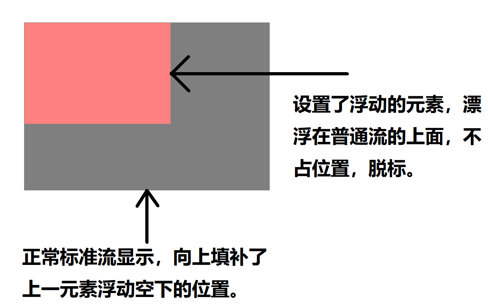

```html
<!doctype html>
<html lang="en">

<head>
    <meta charset="UTF-8">
    <meta name="viewport" content="width=device-width, initial-scale=1.0">
    <meta http-equiv="X-UA-Compatible" content="ie=edge">
    <title>浮动特性1</title>
    <style>
        /* 设置了浮动（float）的元素会：
        1.脱离标准普通流的控制（浮）移动到指定位置（动）。
        2.浮动的盒子不再保留原先的位置 */
        .box1 {
            float: left;
            width: 200px;
            height: 200px;
            background-color: pink;
        }

        .box2 {
            width: 300px;
            height: 300px;
            background-color: gray;
        }
    </style>
</head>

<body>
    <div class="box1">浮动的盒子</div>
    <div class="box2">标准流的盒子</div>
</body>

</html>
```

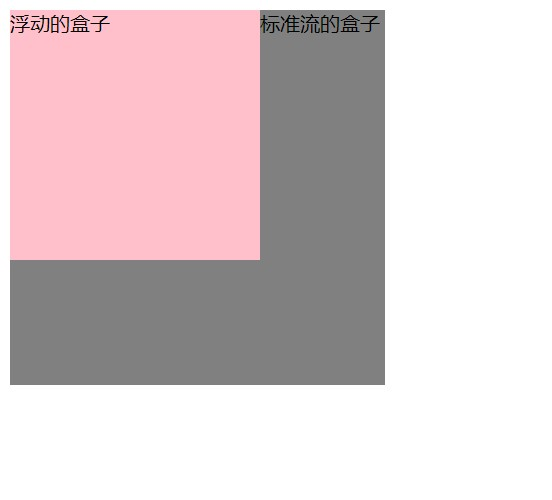

**（2）浮动的元素会一行内显示并且元素顶部对齐**

- 如果多个盒子都设置了浮动，则它们会按照属性值一行内显示并且顶端对齐排列。
- 浮动的元素是互相贴靠在一起的（不会有缝隙），如果父级宽度装不下这些浮动的盒子，多出的盒子会另起一行对齐。

```html
<!doctype html>
<html lang="en">

<head>
    <meta charset="UTF-8">
    <meta name="viewport" content="width=device-width, initial-scale=1.0">
    <meta http-equiv="X-UA-Compatible" content="ie=edge">
    <title>浮动元素特性-浮动元素一行显示</title>
    <style>
        div {
            float: left;
            width: 200px;
            height: 200px;
            background-color: pink;
        }

        .two {
            background-color: skyblue;
            height: 249px;
        }

        .four {
            background-color: skyblue;
        }
    </style>
</head>

<body>
    <div>1</div>
    <div class="two">2</div>
    <div>3</div>
    <div class="four">4</div>
</body>

</html>
```


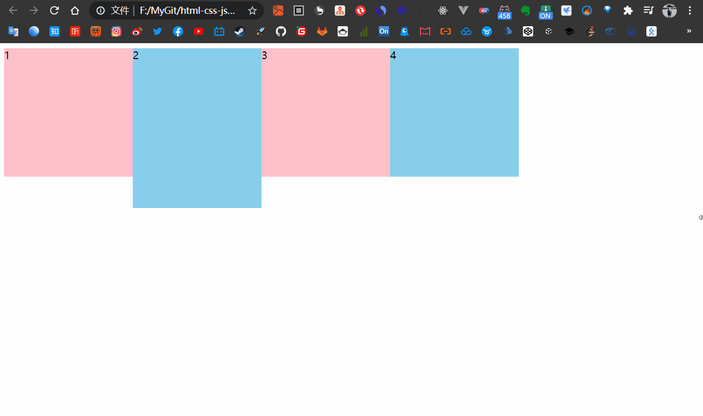

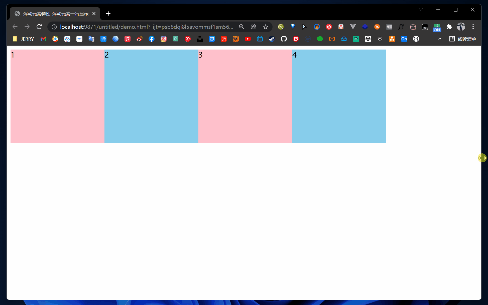

**（3）浮动的元素会具有行内块元素的特性**

任何元素都可以浮动。不管原先是什么模式的元素，添加浮动之后具有行内块元素相似的特性。

- 块级盒子：没有设置宽度时默认宽度和父级一样宽，但是添加浮动后，它的大小根据内容来决定
- 行内盒子：宽度默认和内容一样宽，直接设置高宽无效，但是添加浮动后，它的大小可以直接设置
- 浮动的盒子中间是没有缝隙的，是紧挨着一起的
- **即：默认宽度由内容决定，同时支持指定高宽，盒子之间无空隙**

```html
<!doctype html>
<html lang="en">

<head>
    <meta charset="UTF-8">
    <meta name="viewport" content="width=device-width, initial-scale=1.0">
    <meta http-equiv="X-UA-Compatible" content="ie=edge">
    <title>浮动的元素具有行内块元素特点</title>
    <style>
        /* 任何元素都可以浮动。不管原先是什么模式的元素，添加浮动之后具有行内块元素相似的特性。 */
        span,
        div {
            float: left;
            width: 200px;
            height: 100px;
            background-color: pink;
        }

        /* 如果行内元素有了浮动，则不需要转换块级\行内块元素就可以直接给高度和宽度 */
        p {
            float: right;
            height: 200px;
            background-color: skyblue;
        }
    </style>
</head>

<body>
    <span>span1</span>
    <span>span2</span>

    <div>div</div>
    <p>pppppppppppppp</p>
</body>

</html>
```


注意：之所以顶部没有对齐，原因是 p 标签自带的外边距 > span div 自带的外边距。

```html
<!doctype html>
<html lang="en">

<head>
    <meta charset="UTF-8">
    <meta name="viewport" content="width=device-width, initial-scale=1.0">
    <meta http-equiv="X-UA-Compatible" content="ie=edge">
    <title>浮动的元素具有行内块元素特点</title>
    <style>
        * {
            margin: 0px;
        }

        /* 任何元素都可以浮动。不管原先是什么模式的元素，添加浮动之后具有行内块元素相似的特性。 */
        span,
        div {
            float: left;
            width: 200px;
            height: 100px;
            background-color: pink;
        }

        /* 如果行内元素有了浮动,则不需要转换块级\行内块元素就可以直接给高度和宽度 */
        p {
            float: right;
            height: 200px;
            background-color: skyblue;
        }
    </style>
</head>

<body>
    <span>span1</span>
    <span>span2</span>

    <div>div</div>
    <p>pppppppppppppp</p>
</body>

</html>
```


## 1.6 浮动元素经常和标准流父级搭配使用

为了约束浮动元素位置，我们网页布局一般采取的策略是：

**先用标准流的父元素排列上下位置，之后内部子元素采取浮动排列左右位置。符合网页布局第一准侧。**


应用举例：

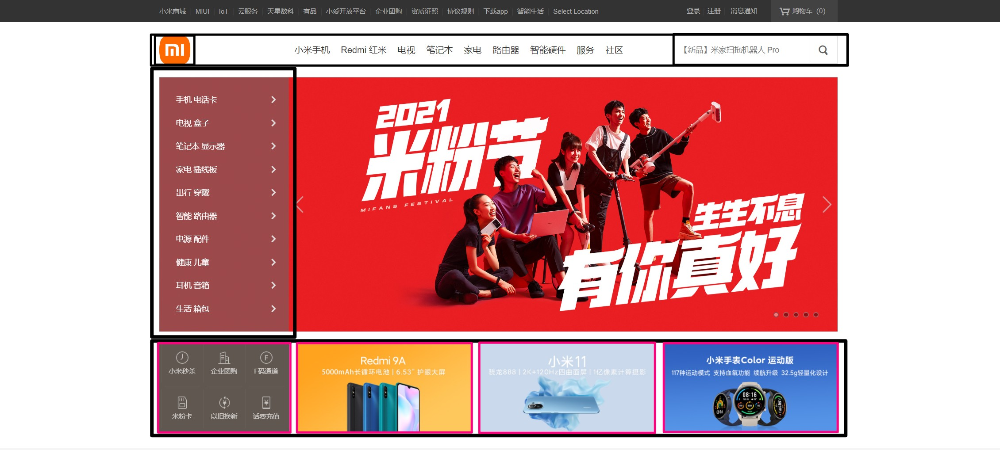

```html
<!doctype html>
<html lang="en">

<head>
    <meta charset="UTF-8">
    <meta name="viewport" content="width=device-width, initial-scale=1.0">
    <meta http-equiv="X-UA-Compatible" content="ie=edge">
    <title>浮动元素搭配标准流父盒子1</title>
    <style>
        .box {
            width: 1200px;
            height: 460px;
            background-color: black;
            margin: 0 auto;
        }

        .left {
            float: left;
            width: 230px;
            height: 460px;
            background-color: pink;
        }

        .right {
            float: left;
            width: 970px;
            height: 460px;
            background-color: skyblue;
        }
    </style>
</head>

<body>
    <div class="box">
        <div class="left">左侧</div>
        <div class="right">右侧</div>
    </div>
</body>

</html>
```


---


```html
<!doctype html>
<html lang="en">

<head>
    <meta charset="UTF-8">
    <meta name="viewport" content="width=device-width, initial-scale=1.0">
    <meta http-equiv="X-UA-Compatible" content="ie=edge">
    <title>浮动元素搭配标准流父盒子2</title>
    <style>
        * {
            margin: 0;
            padding: 0;
        }

        /* 取消 li 前的圆点 */
        li {
            list-style: none;
        }

        .box {
            width: 1226px;
            height: 285px;
            background-color: pink;
            /* 让大盒子水平居中 */
            margin: 0 auto;
        }

        .box li {
            width: 296px;
            height: 285px;
            background-color: gray;
            float: left;
            /* 每个小盒子用右边距隔开 */
            margin-right: 14px;
        }

        /* 取消最后一个小盒子的右外边距 */
        /* 这里必须写 .box .last 要注意权重的问题  20 */
        .box .last {
            margin-right: 0;
        }
    </style>
</head>

<body>
    <ul class="box">
        <li>1</li>
        <li>2</li>
        <li>3</li>
        <li class="last">4</li>
    </ul>
</body>

</html>
```


---

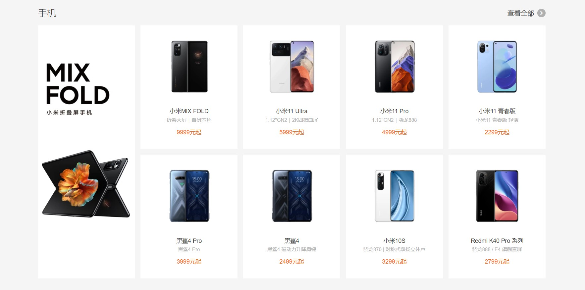

```html
<!doctype html>
<html lang="en">

<head>
    <meta charset="UTF-8">
    <meta name="viewport" content="width=device-width, initial-scale=1.0">
    <meta http-equiv="X-UA-Compatible" content="ie=edge">
    <title>浮动布局练习3</title>
    <style>
        .box {
            width: 1226px;
            height: 615px;
            background-color: pink;
            margin: 0 auto;
        }

        .left {
            float: left;
            width: 234px;
            height: 615px;
            background-color: gray;
        }

        .right {
            float: left;
            width: 992px;
            height: 615px;
            background-color: skyblue;
        }

        .right>div {
            float: left;
            width: 234px;
            height: 300px;
            background-color: pink;
            margin-left: 14px;
            margin-bottom: 14px;
        }
    </style>
</head>

<body>
    <div class="box">
        <div class="left">左青龙</div>
        <div class="right">
            <div>1</div>
            <div>2</div>
            <div>3</div>
            <div>4</div>
            <div>5</div>
            <div>6</div>
            <div>7</div>
            <div>8</div>
        </div>
    </div>
</body>

</html>
```

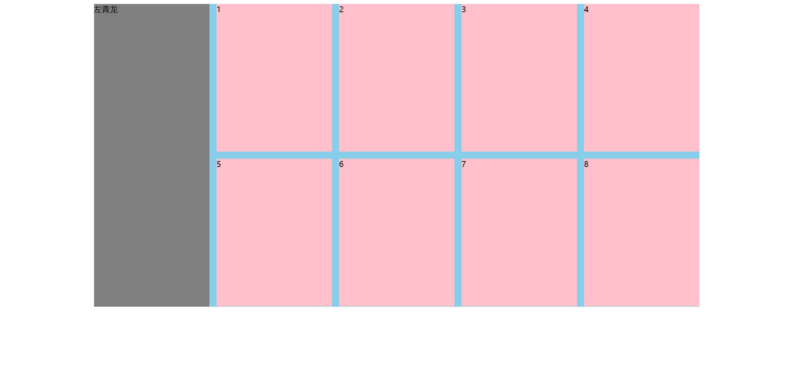

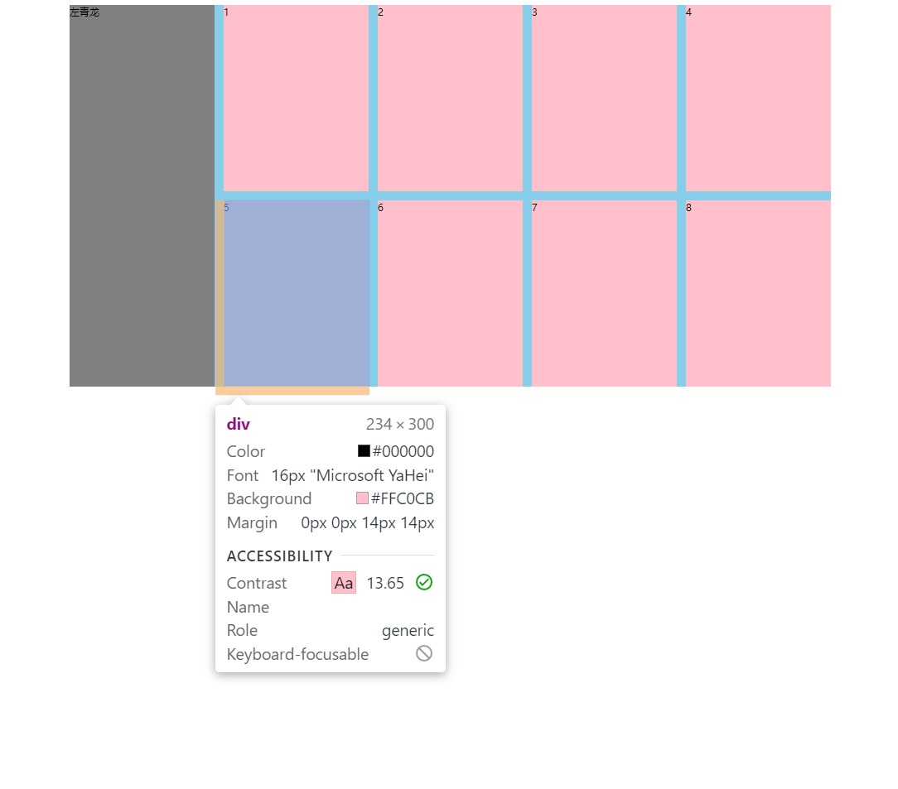

# 二、常见网页布局

## 2.1 初识常见网页布局


```html
<!doctype html>
<html lang="en">

<head>
    <meta charset="UTF-8">
    <meta name="viewport" content="width=device-width, initial-scale=1.0">
    <meta http-equiv="X-UA-Compatible" content="ie=edge">
    <title>常见网页布局</title>
    <style>
        * {
            margin: 0;
            padding: 0;
        }

        li {
            list-style: none;
        }

        .top {
            height: 50px;
            background-color: gray;
        }

        .banner {
            width: 980px;
            height: 150px;
            background-color: gray;
            margin: 10px auto;
        }

        .box {
            width: 980px;
            margin: 0 auto;
            height: 300px;
            background-color: pink;
        }

        .box li {
            float: left;
            width: 237px;
            height: 300px;
            background-color: gray;
            margin-right: 10px;
        }

        .box .last {
            margin-right: 0;
        }

        /* 只要是通栏的盒子（和浏览器一样宽）不需要指定宽度 */
        .footer {
            height: 200px;
            background-color: gray;
            margin-top: 10px;
        }
    </style>
</head>

<body>
    <div class="top">top</div>
    <div class="banner">banner</div>
    <div class="box">
        <ul>
            <li>1</li>
            <li>2</li>
            <li>3</li>
            <li class="last">4</li>
        </ul>
    </div>
    <div class="footer">footer</div>
</body>

</html>
```

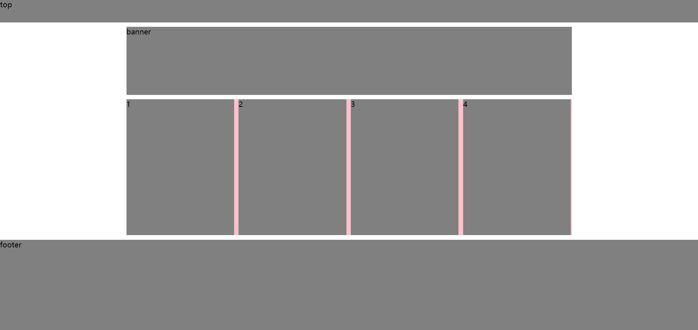

## 2.2 浮动布局注意点

**（1）浮动和标准流的父盒子搭配**

先用标准流的父元素排列上下位置，之后内部子元素采取浮动排列左右位置。

**（2）一个元素浮动了，理论上其余的兄弟元素也要浮动**

一个盒子里面有多个子盒子，如果其中一个盒子浮动了，那么其他兄弟也应该浮动，以防止引起问题。

浮动的盒子只会影响浮动盒子后面的标准流，不会影响前面的标准流。

```html
<!doctype html>
<html lang="en">

<head>
    <meta charset="UTF-8">
    <meta name="viewport" content="width=device-width, initial-scale=1.0">
    <meta http-equiv="X-UA-Compatible" content="ie=edge">
    <title>浮动注意点</title>
    <style>
        /* 如果一个子元素浮动了，尽量其他盒子也浮动，这样保证这些子元素一行显示 */
        .box {
            width: 900px;
            height: 300px;
            background-color: black;
            margin: 0 auto;
        }

        .damao {
            float: left;
            width: 200px;
            height: 200px;
            background-color: palevioletred;
        }

        .ermao {
            float: left;
            width: 200px;
            height: 150px;
            background-color: palegreen;
        }

        .sanmao {
            float: left;
            width: 300px;
            height: 240px;
            background-color: skyblue;
        }
    </style>
</head>

<body>
    <div class="box">
        <div class="damao">大毛</div>		<!-- float: left; -->
        <div class="ermao">二毛</div>		<!-- float: left; -->
        <div class="sanmao">三毛</div>	<!-- float: left; -->
    </div>
</body>

</html>
```


---

```html
<!doctype html>
<html lang="en">

<head>
    <meta charset="UTF-8">
    <meta name="viewport" content="width=device-width, initial-scale=1.0">
    <meta http-equiv="X-UA-Compatible" content="ie=edge">
    <title>浮动注意点</title>
    <style>
        /* 浮动的盒子只会影响浮动盒子后面的标准流，不会影响前面的标准流。 */
        /* 大毛为标准流，所以大毛会占据其所在的一行，后面的二毛就算浮动也不会跑到大毛上方！*/
        .box {
            width: 900px;
            height: 300px;
            background-color: black;
            margin: 0 auto;
        }

        .damao {
            /* float: left; */
            width: 200px;
            height: 200px;
            background-color: palevioletred;
        }

        .ermao {
            float: left;
            width: 200px;
            height: 150px;
            background-color: palegreen;
        }

        .sanmao {
            float: left;
            width: 300px;
            height: 240px;
            background-color: skyblue;
        }
    </style>
</head>

<body>
    <div class="box">
        <div class="damao">大毛</div>		<!-- 标准流 -->
        <div class="ermao">二毛</div>		<!-- float: left; -->
        <div class="sanmao">三毛</div>	<!-- float: left; -->
    </div>
</body>

</html>
```

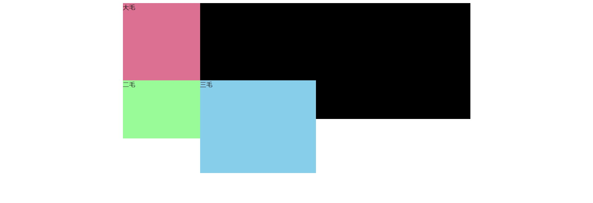

---

```html
<!doctype html>
<html lang="en">

<head>
    <meta charset="UTF-8">
    <meta name="viewport" content="width=device-width, initial-scale=1.0">
    <meta http-equiv="X-UA-Compatible" content="ie=edge">
    <title>浮动注意点</title>
    <style>
        /* 浮动的盒子只会影响浮动盒子后面的标准流，不会影响前面的标准流。 */
        .box {
            width: 900px;
            height: 300px;
            background-color: black;
            margin: 0 auto;
        }

        .damao {
            float: left;
            width: 200px;
            height: 200px;
            background-color: palevioletred;
        }

        .ermao {
            /* float: left; */
            width: 200px;
            height: 150px;
            background-color: palegreen;
        }

        .sanmao {
            float: left;
            width: 300px;
            height: 240px;
            background-color: skyblue;
        }
    </style>
</head>

<body>
    <div class="box">
        <div class="damao">大毛</div>		<!-- float: left; -->
        <div class="ermao">二毛</div>		<!-- 标准流 -->
        <div class="sanmao">三毛</div>	<!-- float: left; -->
    </div>
</body>

</html>
```

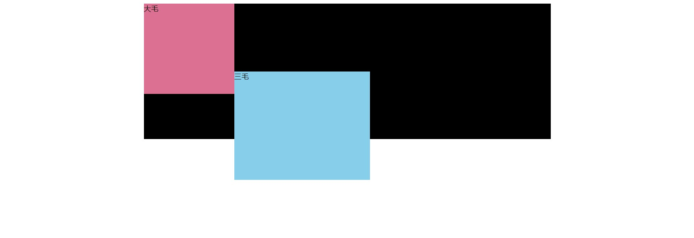

由于大毛是浮动的，所以原来大毛的位置会空出来，此时二毛就会向上补齐空位，由于二毛高度小于大毛，所以二毛被大毛挡住了，又因为二毛是标准流，所以二毛会占据所在的一行，所以后面浮动的三毛就只能在二毛的底部之下，又由于大毛也是浮动的，所以三毛就会紧贴在大毛右侧。


# 三、清除浮动

## 3.1 思考题

我们前面浮动元素有一个标准流的父元素，他们有一个共同的特点，都是有高度的。

但是，所有的父盒子都必须有高度吗？

答案：不一定！比如，一个产品列表，随着时期的不同，产品数量也不同，所需的盒子大小也会随之改变，那么直接固定盒子高度的形式显然就是不行的。再比如，文章之类的盒子，不同的文章字数是不相同的，那么显然盒子也不能直接固定高度。

理想中的状态，让子盒子撑开父亲。有多少孩子，我父盒子就有多高。

但是不给父盒子高度会有问题吗？

答案：会！但有方法解决（清除浮动）。

## 3.2 为什么需要清除浮动？

由于父级盒子很多情况下不方便给高度，但是子盒子浮动又不占有位置，最后父级盒子高度为 0 时，就会影响下面的标准流盒子。


- 由于浮动元素不再占用原文档流的位置，所以它会对后面的元素排版产生影响

- 此时一但父盒子下面有其他盒子，那么布局就会发生严重混乱！

## 3.3 清除浮动本质

- 清除浮动的本质是清除浮动元素造成的影响
- 如果父盒子本身有高度，则不需要清除浮动
- 清除浮动之后，父级就会根据浮动的子盒子自动检测高度。父级有了高度，就不会影响下面的标准流了

## 3.4 清除浮动

语法：

```css
选择器 { clear: 属性值; }
```

| 属性值 | 描述                                       |
| ------ | ------------------------------------------ |
| left   | 不允许左侧有浮动元素（清除左侧浮动的影响） |
| right  | 不允许右侧有浮动元素（清除右侧浮动的影响） |
| both   | 同时清除左右两侧浮动的影响                 |

我们实际工作中，几乎只用 `clear: both;`

清除浮动的策略是：闭合浮动。

## 3.5 清除浮动方法

1. 额外标签法也称为隔墙法，是 W3C 推荐的做法。(实际开发不推荐)
2. 父级添加 overflow 属性
3. 父级添加 after 伪元素
4. 父级添加 双伪元素

## 3.6 清除浮动 —— 额外标签法

额外标签法也称为隔墙法，是 W3C 推荐的做法。

额外标签法会在浮动元素末尾添加一个空的标签。例如 `<div style="clear: both"></div>`，或者其他标签（如 `<br>` 等）。

- 优点： 通俗易懂，书写方便
- 缺点： 添加许多无意义的标签，结构化较差

注意： 要求这个新的空标签必须是**块级元素**。

总结：

- 清除浮动本质是？

清除浮动的本质是清除浮动元素脱离标准流造成的影响。

- 清除浮动策略是？

闭合浮动。只让浮动在父盒子内部影响，不影响父盒子外面的其他盒子。

- 额外标签法？

**隔墙法，就是在最后一个浮动的子元素后面添加一个额外空标签（块级标签），添加清除浮动样式。**

实际工作可能会遇到，但是不常用。

```html
<!doctype html>
<html lang="en">

<head>
    <meta charset="UTF-8">
    <meta name="viewport" content="width=device-width, initial-scale=1.0">
    <meta http-equiv="X-UA-Compatible" content="ie=edge">
    <title>清除浮动之额外标签法</title>
    <style>
        .box {
            width: 800px;
            border: 3px solid black;
            margin: 0 auto;
        }

        .damao {
            float: left;
            width: 300px;
            height: 200px;
            background-color: salmon;
        }

        .ermao {
            float: left;
            width: 200px;
            height: 200px;
            background-color: skyblue;
        }

        .footer {
            height: 200px;
            background-color: gray;
        }

        .clear {
            clear: both;
        }
    </style>
</head>

<body>
    <div class="box">
        <div class="damao">大毛</div>
        <div class="ermao">二毛</div>
        <div class="ermao">二毛</div>
        <div class="ermao">二毛</div>
        <div class="ermao">二毛</div>
        <div class="clear"></div>
        <!-- 这个新增的盒子要求必须是块级元素不能是行内元素 -->
        <!-- <span class="clear"></span> -->
    </div>
    <div class="footer"></div>

</body>

</html>
```


## 3.7 清除浮动 —— 父级添加 overflow

可以给父级添加 `overflow` 属性，将其属性值设置为 `hidden`、 `auto` 或 `scroll`。

子不教，父之过，注意是给父元素添加代码。

- 优点：代码简洁
- 缺点：无法显示溢出的部分

```html
<!doctype html>
<html lang="en">

<head>
    <meta charset="UTF-8">
    <meta name="viewport" content="width=device-width, initial-scale=1.0">
    <meta http-equiv="X-UA-Compatible" content="ie=edge">
    <title>overflow清除浮动</title>
    <style>
        .box {
            /* 清除浮动 */
            overflow: hidden;
            width: 800px;
            border: 1px solid blue;
            margin: 0 auto;
        }

        .damao {
            float: left;
            width: 300px;
            height: 200px;
            background-color: purple;
        }

        .ermao {
            float: left;
            width: 200px;
            height: 200px;
            background-color: pink;
        }

        .footer {
            height: 200px;
            background-color: black;
        }
    </style>
</head>

<body>
    <div class="box">
        <div class="damao">大毛</div>
        <div class="ermao">二毛</div>
    </div>
    <div class="footer"></div>

</body>

</html>
```


## 3.8 清除浮动 —— :after 伪元素法

`:after` 方式是额外标签法的升级版，也是给父元素添加代码。

原理：自动在父盒子里的末尾添加一个 行内盒子，我们将它转换为 块级盒子，就间接实现了额外标签法。

```css
.clearfix:after {
	content: "";
	display: block;
	height: 0;
	clear: both;
	visibility: hidden;
}

.clearfix { 
    /* IE6、7 专有 */
	*zoom: 1;
}
```

注意：类名不一定非要是 clearfix，但是还是推荐这么写以提高可读性。

- 优点：没有增加标签，结构更简单
- 缺点：需要单独照顾低版本浏览器
- 代表网站： 百度、淘宝网、网易等

```html
<!doctype html>
<html lang="en">

<head>
    <meta charset="UTF-8">
    <meta name="viewport" content="width=device-width, initial-scale=1.0">
    <meta http-equiv="X-UA-Compatible" content="ie=edge">
    <title>伪元素清除浮动</title>
    <style>
        .clearfix:after {
            content: "";
            display: block;
            height: 0;
            clear: both;
            visibility: hidden;
        }

        .clearfix {
            /* IE6、7 专有 */
            *zoom: 1;
        }

        .box {
            width: 800px;
            border: 1px solid blue;
            margin: 0 auto;
        }

        .damao {
            float: left;
            width: 300px;
            height: 200px;
            background-color: purple;
        }

        .ermao {
            float: left;
            width: 200px;
            height: 200px;
            background-color: pink;
        }

        .footer {
            height: 200px;
            background-color: black;
        }
    </style>
</head>

<body>
    <div class="box clearfix">
        <div class="damao">大毛</div>
        <div class="ermao">二毛</div>
    </div>
    <div class="footer"></div>

</body>

</html>
```


## 3.9 清除浮动 —— 双伪元素清除浮动

额外标签法的升级版，也是给给父元素添加代码。

原理：自动在父盒子里的两端添加两个行内盒子，并把它们转换为 表格，间接实现了额外标签法。

```css
.clearfix:before,
.clearfix:after {
	content: "";
	display: table;
}

.clearfix:after {
	clear: both;
}

.clearfix {
    /* IE6、7 专有 */
	*zoom:1;
}
```

注意：类名不一定非要是 clearfix，但是还是推荐这么写以提高可读性。

- 优点：代码更简洁
- 缺点：需要单独照顾低版本浏览器

- 代表网站：小米、腾讯等

```html
<!doctype html>
<html lang="en">

<head>
    <meta charset="UTF-8">
    <meta name="viewport" content="width=device-width, initial-scale=1.0">
    <meta http-equiv="X-UA-Compatible" content="ie=edge">
    <title>双伪元素清除浮动</title>
    <style>
        .clearfix:before,
        .clearfix:after {
            content: "";
            display: table;
        }

        .clearfix:after {
            clear: both;
        }

        .clearfix {
            *zoom: 1;
        }

        .box {
            width: 800px;
            border: 1px solid blue;
            margin: 0 auto;
        }

        .damao {
            float: left;
            width: 300px;
            height: 200px;
            background-color: purple;
        }

        .ermao {
            float: left;
            width: 200px;
            height: 200px;
            background-color: pink;
        }

        .footer {
            height: 200px;
            background-color: black;
        }
    </style>
</head>

<body>
    <div class="box clearfix">
        <div class="damao">大毛</div>
        <div class="ermao">二毛</div>
    </div>
    <div class="footer"></div>

</body>

</html>
```


## 3.10 清除浮动总结

为什么需要清除浮动？

- 父级没高度
- 子盒子浮动了
- 影响下面布局了，我们就应该清除浮动了

| 清除浮动的方式         | 优点               | 缺点                                 |
| ---------------------- | ------------------ | ------------------------------------ |
| 额外标签法（隔墙法）   | 通俗易懂，书写方便 | 添加许多无意义的标签，结构化较差     |
| 父级 overflow: hidden; | 书写简单           | 溢出隐藏                             |
| 父级 after 伪元素      | 结构语义化正确     | 由于 IE6~7 不支持 :after，兼容性问题 |
| 父级双伪元素           | 结构语义化正确     | 由于 IE6~7 不支持 :after，兼容性问题 |

> after 伪元素、双伪元素 清除浮动的原理将在后面的 CSS3 中解释。
