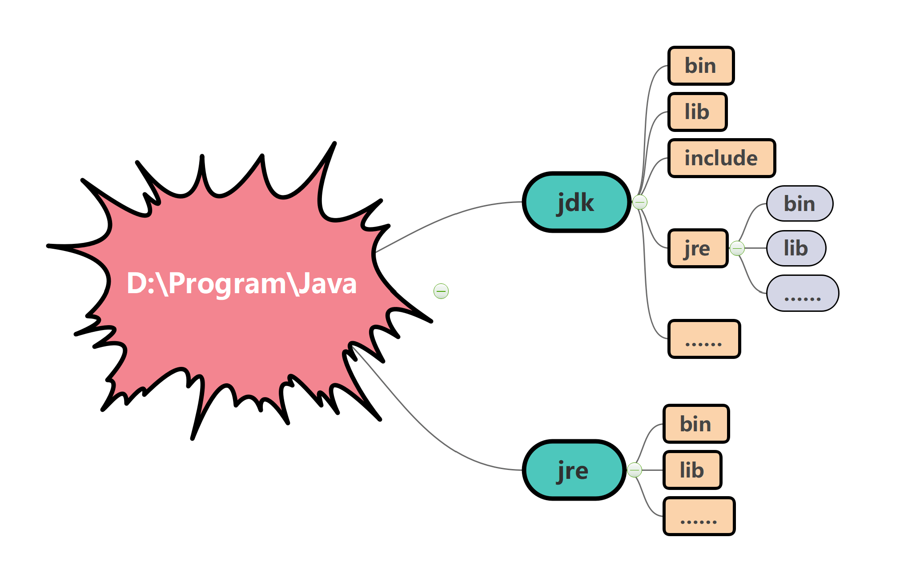
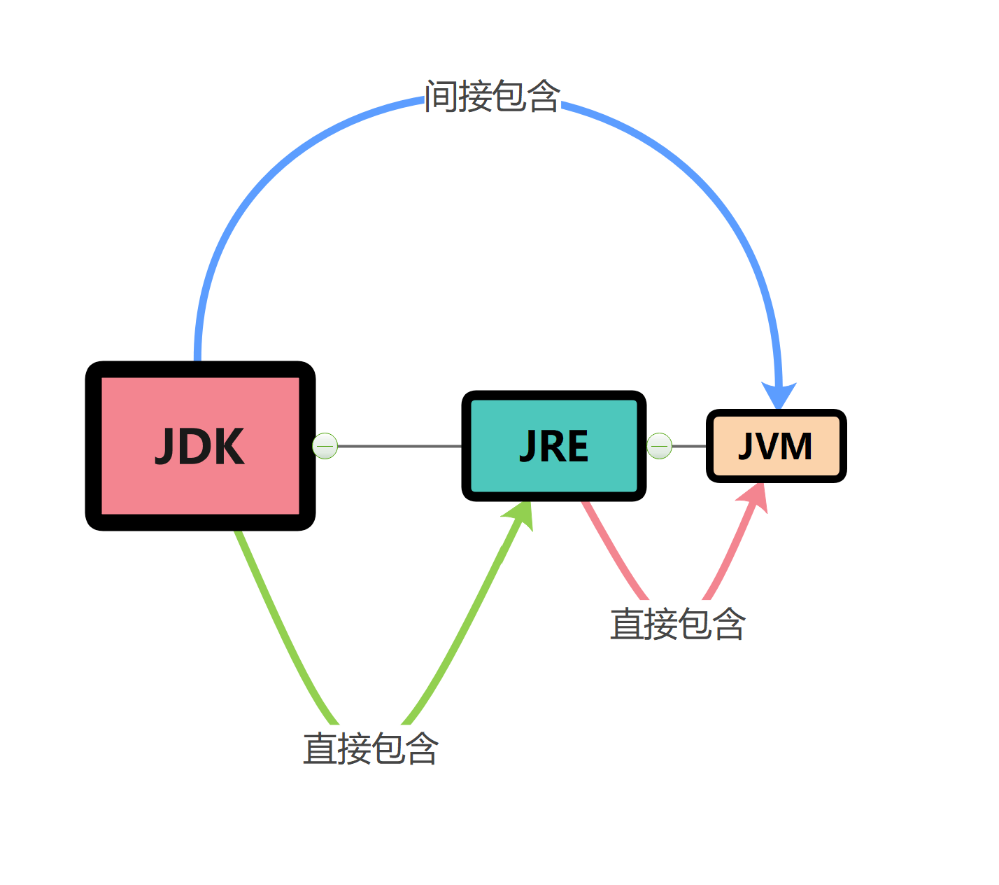
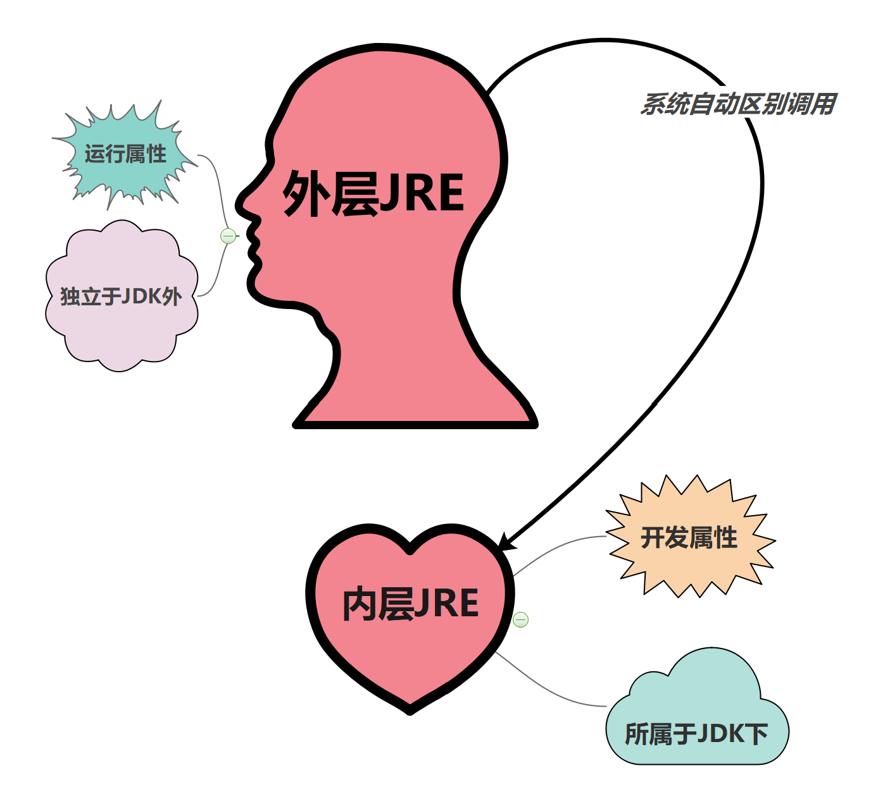

# 【Java JDK 安装目录及其子目录含义】

> 原创内容，转载请注明出处！

# 一、JDK 安装目录及其子目录结构图

> 这里以 JDK 1.8.0_231 版本为例
> JDK 安装在了：D:\Program\Java 目录下

当 JDK 安装完成后，在安装目录下除了 jdk 文件夹， 还会出现一个 jre 文件夹，而 jdk 文件夹内部也包含一个 jre 文件夹……，具体含义待会再说，先看一下 JDK 安装目录及其子目录结构图： 

# 二、认识 JDK 与 JRE
## 2.1 啥是 JDK ?
JDK 即 Java SDK （全称：Java 程序开发工具包），JDK 是整个 Java 的核心，包括了 Java 的 开发环境 和 运行环境，以及一堆 Java 工具（tools.jar）和 Java 基础的类库（rt.jar）等。
## 2.2 啥是 JRE ?
JRE 即 Java 运行环境，是运行 Java 程序所必须的环境集合，包含 JVM （JAVA 虚拟机）标准实现、Java 核心类库（API）及支持文件，但不包含开发工具（编译器、调试器等）。

## 2.3 JDK 与 JRE 的关系 

### 2.3.1 区别
JDK 是开发工具包，是用来开发 Java 程序的，面对的是 Java 的程序开发人员。而 JRE 是只是运行环境，面向的是单纯的 Java 程序使用者。

也就是说，如果要使用 Java 开发程序，则必须安装 JDK。但如果只是想运行 Java 程序，那只需要安装 JRE 即可。

### 2.3.2 联系
> 参考以下 Java 源文件的编译和执行过程

1. Java 源文件（.java）经过 Java 编译器（javac.exe）编译以后形成 JVM 可运行的字节码（.class）文件。

2. 运行 Java 解释器（java.exe）即可利用 JVM 将目标字节码（.class 文件）解释成为具体平台所适配的机器码（通常为：二进制码），此时也就可以运行该 Java 程序了。

3. 任何一台机器只要配备了 Java 解释器，就可以运行 Java 程序，而不管这种字节码是在何种平台上生成的。但要注意的是 Java 解释器只是一个基于 JVM 平台的程序，所以它不能单独执行，必须依赖于JVM。

### 2.3.3 包含

- 由上图可知：JDK 包含 JRE 包含 JVM

- 所以，安装 JDK 就间接安装 JRE 及 JVM 了

# 三、JDK 各个文件夹含义详解
## 3.1 D:\Program\Java\jdk 目录

### 3.1.1 D:\Program\Java\jdk
jdk 根目录，包含版权、许可及 README 文件以及 Java 核心平台 API 的源文件归档（src.zip）。

### 3.1.2 --jdk\bin
jdk 开发工具可执行文件目录，里面包含有 javac.exe、java.exe 等可执行程序。

### 3.1.3 --jdk\lib
jdk 开发工具使用的类库目录，主要包括 tools.jar 和 dt.jar。

### 3.1.4 --jdk\jre
jdk 开发工具所使用的 Java 运行时环境的根目录，除了文档外，它与可部署的 jre 完全相同。

### 3.1.5 --jdk\include
c 的头文件，用与支持 native-code 库使用 jvm Debugger（虚拟机调试器）接口。

## 3.2 D:\Program\Java\jdk\jre 目录

### 3.2.1 D:\Program\Java\jdk\jre
Java 运行环境存放目录。

### 3.2.2 --jdk\jre\bin
jre 执行文件及 DLL 库，可执行文件与 jdk\bin 相同，不必将该目录放在 path 环境变量中。

### 3.2.3 --jdk\jre\lib
 Java 程序运行时环境使用的代码库、属性设置和资源文件，主要包括：

**（1）rt.jar**

系统引导库（构成 Java 平台核心 API 的 RunTime 类）。

**（2）charsets.jar**

字符转换类及其它与国际化和本地化有关的类。

**（3）--jdk\jre\lib\ext**

Java 平台扩展类库的缺省安装目录。例如 JavaHelp jar 就可以放在此目录下。

**（4）--jdk\jre\lib\security**

包含用于安全管理的文件。这些文件包括安全策略（java.policy）和安全属性（java.security）文件。

**（5）--jdk\jre\lib\applet**

对 applet 支持的一些资源文件。

**（6）--jdk\jre\lib\fonts**

TrueType 字体文件。

## 3.3 为什么 Java 目录中会存在两个 jre 目录以及三个 lib 目录，他们的作用和区别又是什么？

### 3.3.1 两个 jre 目录
**（1）D:\Program\Java\jre**

可部署的 JRE。

**（2）D:\Program\Java\jdk\jre**

jdk 中自带并使用的 JRE。

**（3）区别及联系**

总体来说，两个 JRE 文件夹的内容基本相同，区别主要体现在工作的职责上，也就是不同的 JRE 负责不同的工作范围。

如果只是要执行 Java 程序，则只需要 Java 目录下的 JRE 即可。如果要开发 Java 程序，则需要 JDK 中的 JRE。比如我们使用 javac.exe 来编译 Java 程序时，系统会优先使用 jdk\bin 下的可执行文件，使用的运行环境也是 jdk 下的 jre。

### 3.3.2 三个 lib 目录

- D:\Program\Java\jre\lib：jre下的
- D:\Program\Java\jdk\lib：jdk下的
- D:\Program\Java\jdk\jre\lib：jdk\jre下的

**（1）jre 下的 lib**

只是运行 java 程序的 jar 包，是为 JVM 运行时候用的，包括所有的标准类库和扩展类等。

**（2）jdk 下的 lib**

包括 java 开发环境的 jar 包，是给 JDK 用的，例如 JDK 下有一些工具，可能要用该目录中的文件，比如编译器等。

**（3）jdk 下的 jre 下的 lib**

是开发环境中，运行时需要的 jar 包。最典型的就是导入的外部驱动 jar 包，因为编译时，系统找的是 jdk 下的 jre，而不是最外层的 jre。

> 总结：
>
> 1、单纯的 Java 运行使用最外层 jre
>
> 2、开发中的 Java 运行使用 jdk 下的 jre