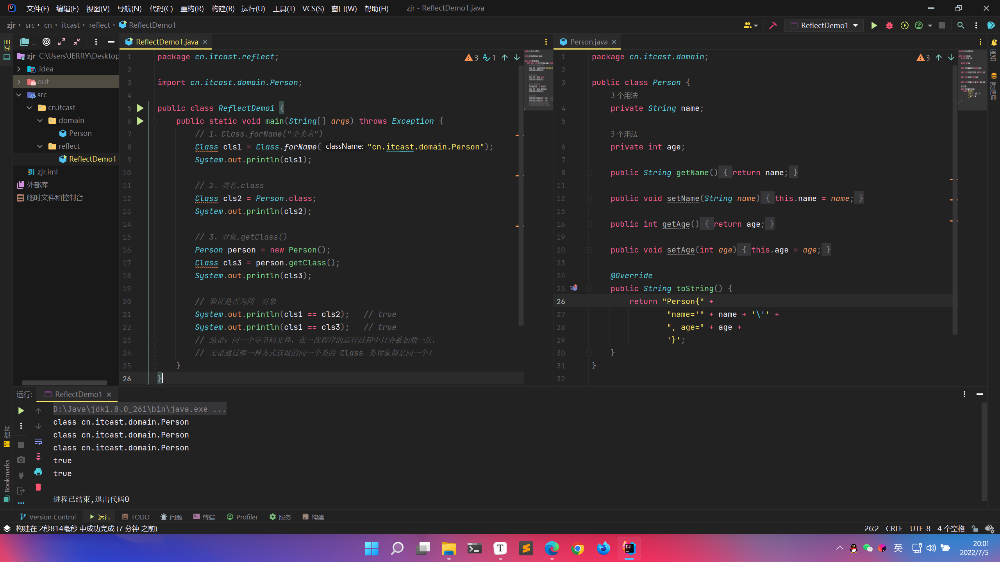
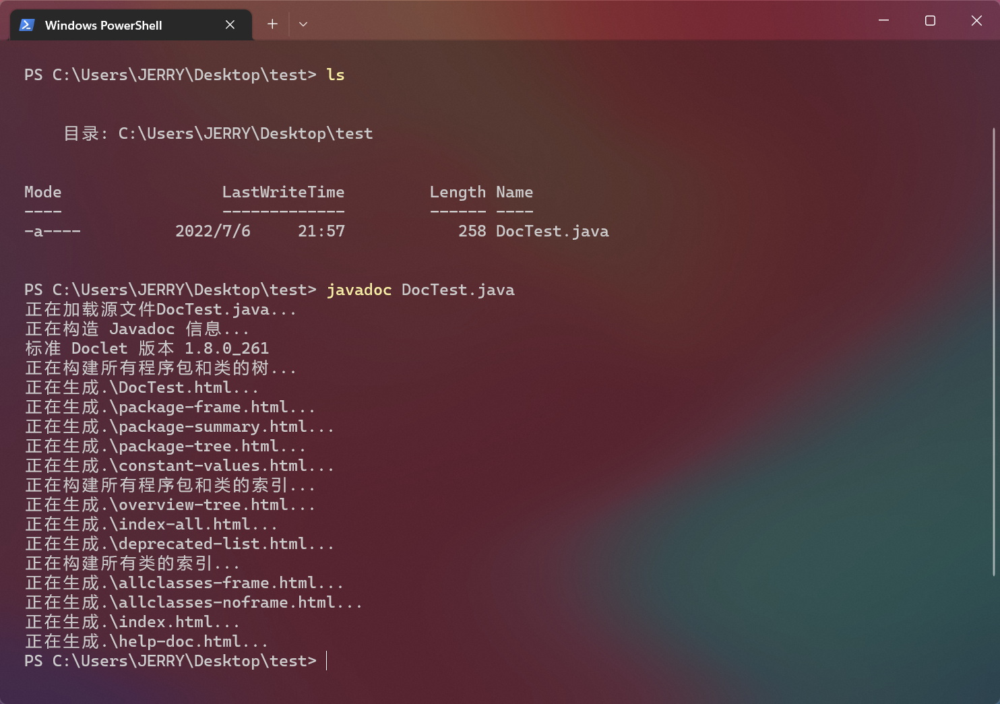
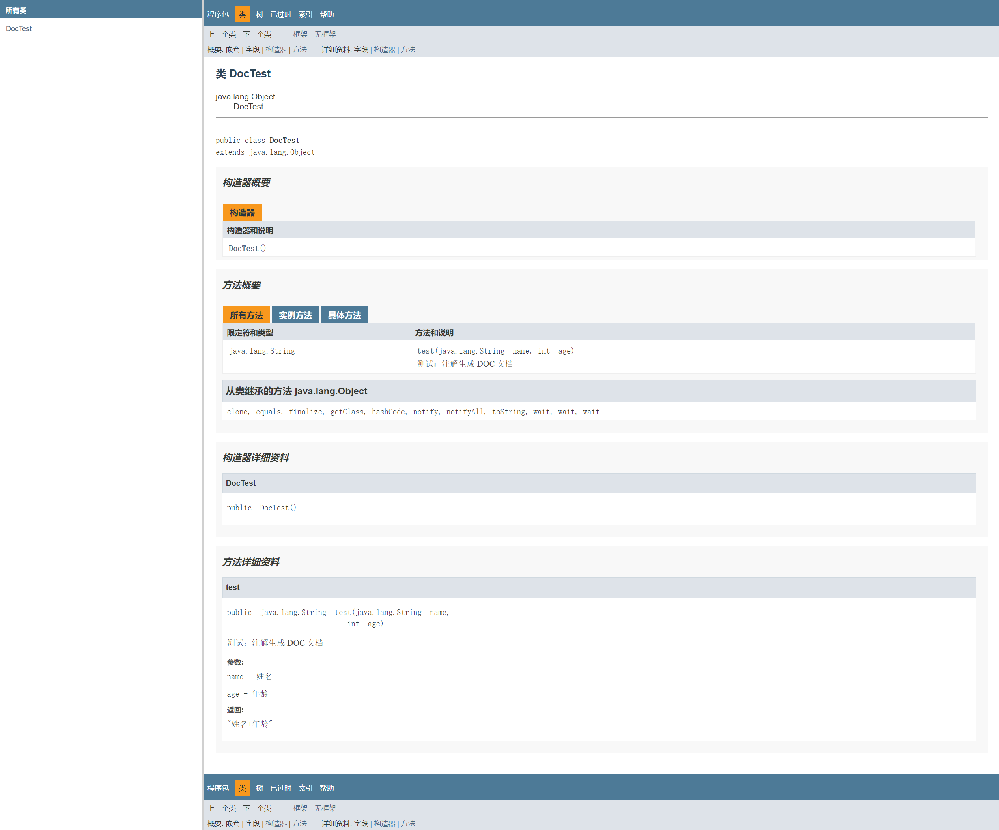

# 反射和注解

# 一、反射

> 反射：框架设计的灵魂！
>
> 对于 Java 而言：框架 = 设计模式 + 反射 + (注解)
>
> > 注意：对于基本的框架使用是不需要懂反射的，但是对于深入理解框架或设计框架则必须懂反射。

反射：将类的各个组成部分封装为对象，这就是反射机制。

> Java 反射机制是在程序运行状态中，可以构造任意一个类的对象，可以得到任意一个对象所属的类的信息，可以调用任意一个类的成员变量和方法，可以获取任意一个对象的属性和方法。反射机制的优点是可以实现动态创建对象和编译（即：动态编译）。

## 1.1 Java代码在计算机中经历的三个阶段


`.java` 源代码首先通过 javac 编译为 `.class` 字节码文件，此时该字节码文件是存在于硬盘中的，无法提供类的实例化操作，需要通过类加载器（ClassLoader 对象）将字节码文件里的内容加载为 Class 类对象，此时该类对象中把原先代码中的成员变量、构造方法、成员方法都包装为了对应的对象数组（之所以是对象是因为后续需要独立操作，之所以是数组是因为也许不止一个），最后我们在运行中实例化对象便会调用 Class 类对象中相应的对象的方法。

> 反射的原理其实就可以理解为阶段二，所以学习反射关键就在于掌握这个 Class 类。

## 1.2 获取Class对象的三个方式

1. `Class.forName("全类名")`：将字节码文件加载进内存，返回 Class 类对象
   - 多用于配置文件，将全类名定义在配置文件中。读取配置文件，加载类
2. `类名.class`：通过类名的属性 class 来获取，返回 Class 类对象
   - 多用于参数传递
3. `对象.getClass()`：通过对象的 getClass() 方法（在 Object 中定义）来获取，返回 Class 类对象
   - 多用于对象的获取字节码的方式

---

- `cn/itcast/domain/Person.java`

```java
package cn.itcast.domain;

public class Person {
    private String name;

    private int age;

    public String getName() {
        return name;
    }

    public void setName(String name) {
        this.name = name;
    }

    public int getAge() {
        return age;
    }

    public void setAge(int age) {
        this.age = age;
    }

    // 打印对象时会默认调用对象的 toString 方法将其转换为字符串再打印
    // 对象的 toString 方法默认是输出对象的地址
    // 我们重写 toString 方法，让其输出对象的成员变量列表
    @Override
    public String toString() {
        return "Person{" +
                "name='" + name + '\'' +
                ", age=" + age +
                '}';
    }
}
```

- `cn/itcast/reflect/ReflectDemo1.java`

```java
package cn.itcast.reflect;

import cn.itcast.domain.Person;

public class ReflectDemo1 {
    public static void main(String[] args) throws Exception {
        // 1、Class.forName("全类名")
        Class cls1 = Class.forName("cn.itcast.domain.Person");
        System.out.println(cls1);

        // 2、类名.class
        Class cls2 = Person.class;
        System.out.println(cls2);

        // 3、对象.getClass()
        Person person = new Person();
        Class cls3 = person.getClass();
        System.out.println(cls3);

        // 验证是否为同一对象
        System.out.println(cls1 == cls2);   // true
        System.out.println(cls1 == cls3);   // true
        // 结论：同一个字节码文件，在一次程序的运行过程中只会被加载一次，
        // 无论通过哪一种方式获取的同一个类的 Class 类对象都是同一个！
    }
}

/*
运行结果：
class cn.itcast.domain.Person
class cn.itcast.domain.Person
class cn.itcast.domain.Person
true
true
*/
```



## 1.3 使用Class对象

### 1.3.1 Class对象的常见功能：

1. 获取成员变量们：

   - `Field[] getFields()`：获取所有的 public 修饰的成员变量，包括从父类继承来的 public 成员变量
   - `Field getField(String name)`：获取指定名称的 public 修饰的成员变量，包括从父类继承来的 public 成员变量
   - `Field[] getDeclaredFields()`：获取本类所有的成员变量，但是不能获取继承来的成员变量
   - `Field getDeclaredField(String name)`：获取本类指定名称的成员变量，但是不能获取继承来的成员变量

   > 操作：
   >
   > - 设置值：`void set(Object obj, Object value)`
   > - 获取值：`Object get(Object obj)`
   > - 忽略访问权限修饰符的安全检查：`setAccessible(true)`
   >
   > 注意：`getDeclaredFields()`、`getDeclaredField(String name)`方法可以获取到本类所有的成员变量（不能获取继承来的成员变量），但是并不能访问（设置、获取）非 public 类型的成员变量的值！！！，如果要访问非 public 类型的成员变量的值的话，需要忽略访问权限修饰符的安全检查（“暴力反射”）：`obj.setAccessible(true);`，注意：后续的 Declared 遇到非 public 都需要“暴力反射”！

2. 获取构造方法们：

   - `Constructor<?>[] getConstructors()`
   - `Constructor<T> getConstructor(类<?>... parameterTypes)`
   - `Constructor<?>[] getDeclaredConstructors()`
   - `Constructor<T> getDeclaredConstructor(类<?>... parameterTypes)`

   > 操作：
   >
   > - 创建对象：`T newInstance(Object... initargs)`
   >   - 如果使用空参数构造方法创建对象，操作可以简化：Class 对象的 `newInstance` 方法

3. 获取成员方法们：

   - `Method[] getMethods()`
   - `Method getMethod(String name, 类<?>... parameterTypes)`
   - `Method[] getDeclaredMethods()`
   - `Method getDeclaredMethod(String name, 类<?>... parameterTypes)`

   > 操作：
   >
   > - 执行方法：`Object invoke(Object obj, Object... args)`
   > - 获取方法名称：`String getName()`

4. 获取类名：
   - `String getName()`

### 1.3.2 获取Field

```java
package cn.itcast.reflect;

import cn.itcast.domain.Person;

import java.lang.reflect.Field;

public class ReflectDemo {
    public static void main(String[] args) throws Exception {
        Class personClass = Person.class;

        Field[] fields = personClass.getDeclaredFields();

        for (Field field : fields) {
            System.out.println(field);
        }

        // 注意：name 是 public 的，默认是 null
        Field field = personClass.getDeclaredField("name");

        System.out.println(field);

        // 获取成员变量 name 的值
        Person p = new Person();
        Object name = field.get(p);
        System.out.println(name);

        // 设置成员变量 name 的值
        field.set(p, "张三");
        System.out.println(p);
    }
}

/*
public java.lang.String cn.itcast.domain.Person.name
private int cn.itcast.domain.Person.age
public java.lang.String cn.itcast.domain.Person.name
null
Person{name='张三', age=0}
*/
```

```java
package cn.itcast.reflect;

import cn.itcast.domain.Person;

import java.lang.reflect.Field;

public class ReflectDemo {
    public static void main(String[] args) throws Exception {
        Class personClass = Person.class;

        // age 是 private 的，默认是 0
        Field field = personClass.getDeclaredField("age");

        System.out.println(field);

        // 获取非 public 的成员变量需要 “暴力反射”
        field.setAccessible(true);

        // 获取成员变量 age 的值
        Person p = new Person();
        Object name = field.get(p);
        System.out.println(name);

        // 设置成员变量 age 的值
        field.set(p, 18);
        System.out.println(p);
    }
}

/*
private int cn.itcast.domain.Person.age
0
Person{name='null', age=18}
*/
```

### 1.3.3 获取Constructor

```java
package cn.itcast.reflect;

import cn.itcast.domain.Person;

import java.lang.reflect.Constructor;

public class ReflectDemo {
    public static void main(String[] args) throws Exception {
        Class personClass = Person.class;

        // 获取带参构造方法
        Constructor constructor = personClass.getConstructor(String.class, int.class);
        System.out.println(constructor);

        // 创建对象
        Object person = constructor.newInstance("张三", 24);
        System.out.println(person);

        System.out.println("-----------");

        // 获取空参构造方法
        Constructor constructor1 = personClass.getConstructor();
        System.out.println(constructor1);

        // 创建对象
        Object person1 = constructor1.newInstance();
        System.out.println(person1);

        Object o = personClass.newInstance();
        System.out.println(o);
    }
}

/*
public cn.itcast.domain.Person(java.lang.String,int)
Person{name='张三', age=24}
-----------
public cn.itcast.domain.Person()
Person{name='null', age=0}
Person{name='null', age=0}
*/
```

### 1.3.4 获取Method

```java
package cn.itcast.reflect;

import cn.itcast.domain.Person;

import java.lang.reflect.Method;

public class ReflectDemo {
    public static void main(String[] args) throws Exception {
        Class personClass = Person.class;

        // 获取指定名称的方法
        // eat()，不带参函数
        Method eat_method = personClass.getMethod("eat");
        Person p = new Person();
        // 执行方法
        eat_method.invoke(p);

        // 获取指定名称的方法
        // eat(String food)，带参函数
        Method eat_method2 = personClass.getMethod("eat", String.class);
        // 执行方法
        eat_method2.invoke(p, "饭");

        System.out.println("----------------------");

        // 获取所有 public 修饰的方法
        // 由于 Person 类直接继承了 Object 类，所以这里还会包含 Object 类的 Public 方法
        Method[] methods = personClass.getMethods();
        for (Method method : methods) {
            System.out.println(method);
            // 获取方法名称
            String name_method = method.getName();
            System.out.println(name_method);
        }
    }
}

/*
eat...
eat...饭
----------------------
public java.lang.String cn.itcast.domain.Person.toString()
toString
public void cn.itcast.domain.Person.setName(java.lang.String)
setName
public void cn.itcast.domain.Person.eat(java.lang.String)
eat
public void cn.itcast.domain.Person.eat()
eat
public int cn.itcast.domain.Person.getAge()
getAge
public void cn.itcast.domain.Person.setAge(int)
setAge
public final void java.lang.Object.wait() throws java.lang.InterruptedException
wait
public final void java.lang.Object.wait(long,int) throws java.lang.InterruptedException
wait
public final native void java.lang.Object.wait(long) throws java.lang.InterruptedException
wait
public boolean java.lang.Object.equals(java.lang.Object)
equals
public native int java.lang.Object.hashCode()
hashCode
public final native java.lang.Class java.lang.Object.getClass()
getClass
public final native void java.lang.Object.notify()
notify
public final native void java.lang.Object.notifyAll()
notifyAll
*/
```

### 1.3.5 获取类名

```java
package cn.itcast.reflect;

import cn.itcast.domain.Person;

public class ReflectDemo1 {
    public static void main(String[] args) throws Exception {
        Class personClass = Person.class;

        // 获取类名
        String className = personClass.getName();
        System.out.println(className);  // cn.itcast.domain.Person
    }
}
```

## 1.4 案例

> 需求：写一个 “框架”，在不改变该类的任何代码的前提下，可以帮我们创建任意类的对象，并且执行其中任意方法。
>
> - 实现：
>
>   - 配置文件 `.properties`
>
>     - 后缀为 properties 的文件是一种 Java 的配置文件，以 <key，value> 格式存储内容，Java 中可以使用 Properties 类来读取这个文件。
>
>       > 在我们平时写程序的时候，有些参数是经常改变的，而这种改变不是我们预知的。比如说我们开发了一个操作数据库的模块，在开发的时候我们连接本地的数据库 IP ，数据库名称，表名称，数据库主机等信息是我们本地的，要使得这个操作数据的模块具有通用性，那么以上信息就不能写死在程序里。通常我们的做法是用 **配置文件** 来解决。
>       >
>       > 各种语言都有自己所支持的配置文件，配置文件中很多变量是经常改变的，这样做也是为了方便用户，让用户能够脱离程序本身去修改相关的变量设置。像 Python 支持的配置文件是 .ini 文件，同样，它也有自己读取配置文件的类 ConfigParse，方便程序员或用户通过该类的方法来修改 .ini 配置文件。在 Java 中，其配置文件常为 .properties 文件，格式为文本文件，JDK 内置的java.util.Properties 类支持 .properties 文件的读写，为我们操作 .properties 文件提供了便利。
>
>   - 反射
>
> - 步骤：
>
>   - 将需要创建的对象的全类名和需要执行的方法定义在配置文件中
>   - 在程序中加载读取配置文件
>   - 使用反射技术来加载类文件进内存
>   - 创建对象
>   - 执行方法

- `pro.properties`

```properties
className=cn.itcast.domain.Person
methodName=eat
```

- `ReflectTest.java`

```java
package cn.itcast.reflect;

import cn.itcast.domain.Person;
import cn.itcast.domain.Student;

import java.io.IOException;
import java.io.InputStream;
import java.lang.reflect.Method;
import java.util.Properties;

/**
 * 框架类
 */
public class ReflectTest {
    public static void main(String[] args) throws Exception {
        // 不改变该类的任何代码，可以创建任意类的对象，可以执行任意方法
        
        // 1、加载配置文件
        // 1.1 创建 Properties 对象
        Properties pro = new Properties();
        // 1.2 加载配置文件，转换为一个集合（Map集合）
        // 1.2.1 获取 class 目录下的配置文件
        // 通过 Class 对象获得类加载器
        ClassLoader classLoader = ReflectTest.class.getClassLoader();
        // 通过类加载器找到配置文件并以字节流返回
        InputStream is = classLoader.getResourceAsStream("pro.properties");
        // 加载
        pro.load(is);
        
        // 2、获取配置文件中定义的数据
        String className = pro.getProperty("className");
        String methodName = pro.getProperty("methodName");
        
        // ------------------------------------------------
        
        // 3、加载该类进内存
        Class cls = Class.forName(className);
        
        // 4、创建对象
        Object obj = cls.newInstance();
        
        // 5、获取方法对象
        Method method = cls.getMethod(methodName);
        
        // 6、执行方法
        method.invoke(obj);		// sleep...
    }
}
```

# 二、注解

定义：注解（Annotation），也叫元数据。一种代码级别的说明。它是 JDK1.5 及以后版本引入的一个特性，与类、接口、枚举是在同一个层次。它可以声明在包、类、字段、方法、局部变量、方法参数等的前面，用来对这些元素进行说明，注释。

使用：`@注解名称`

> 注释：用文字描述程序（给程序员看的）
>
> 注解：程序代码的说明（给计算机看的）

## 2.1 作用分类

- 编写文档：通过代码里**文档注释**中标识的注解生成文档【（javadoc 命令）生成文档】

  > ```java
  > public class DocTest {
  >    	 /**
  >      * 测试：注解生成 DOC 文档
  >      * @param name 姓名
  >      * @param age 年龄
  >      * @return "姓名+年龄"
  >      */
  >     public String test(String name, int age) {
  >         String s = name + age;
  >         return s;
  >     }
  > }
  > ```
  >
  > 
  >
  > 

- 编译检查：通过代码里标识的注解让编译器能够实现基本的编译检查【例如：Override】

  > `@Override` 检查方法是否是父类方法的重写。
  >
  > 
  >
  > 若不是，则会报错！
  >
  > 
  >
  > 

- 代码分析：通过代码里标识的注解对代码进行分析【配合反射机制】

## 2.2 JDK中预定义的一些注解

- `@Override`：检测被该注解标注的方法是否是继承自父类（接口）的

- `@Deprecated`：该注解标注的内容，表示已过时

  - 通常当一个方法被升级迭代时，依旧会保留原来的老方法（为了兼容旧的使用），但是会给该老方法加上 `@Deprecated`

- `@SuppressWarnings`：压制警告

  - 一般传递参数 `all`：`@SuppressWarnings("all")`

    > 当我们在方法上加 `@SuppressWarnings("all")`，那么该方法的所有警告都会被忽略。如果在类上加，那么该类的所有警告都会被忽略。

## 2.3 自定义注解

格式：

```java
元注解
public @interface 注解名称 {
    属性;
}
```

```java
// @Override 源码
@Target(ElementType.METHOD)
@Retention(RetentionPolicy.SOURCE)
public @interface Override {
}
```

- 本质：注解本质上就是一个接口，该接口默认继承 `Annotation` 接口。
  - `public interface 注解名称 extends java.lang.annotation.Annotation {}`

- 属性：接口中的抽象方法（可以有，也可以没有）

  - 属性要求：

    - 属性的返回值类型有下列取值

      - 基本数据类型

      - String

      - 枚举

      - 注解

      - 以上类型的数组

        > 举例：
        >
        > ```java
        > public @interface MyAnno {
        >     int show1();		// 基本数据类型
        >     String show2();		// String
        >     Person per();		// 枚举
        >     MyAnno2 anno2();	// 注解
        >     String[] strs();	// 以上类型的数组
        > }
        > ```

    - 定义了属性，在使用时需要给属性赋值（多个属性之间用 `,` 间隔）

      - 如果定义属性时，使用 `default` 关键字给属性默认初始化值，则使用注解时，可以不进行属性的赋值

      - 如果只有一个属性需要赋值，并且属性的名称是 value，则 value 可以省略，直接定义值即可

      - 数组赋值时，值使用 `{}` 包裹。如果数组中只有一个值，则 `{}` 可以省略

        > 举例：
        >
        > ```java
        > package cn.itcast.annotation;
        > 
        > public @interface MyAnno {
        >     int age();
        >     String name() default "张三";
        > }
        > ```
        >
        > ```java
        > package cn.itcast.annotation;
        > 
        > // 定义了属性，在使用时需要给属性赋值
        > // @MyAnno(age = 18, name = "李四")
        > // 使用 default 关键字给属性默认初始化值，则使用注解时，可以不进行属性的赋值
        > @MyAnno(age = 18)
        > public class Worker {
        > }
        > ```
        >
        > ---
        >
        > ```java
        > package cn.itcast.annotation;
        > 
        > public @interface MyAnno {
        >     boolean value();
        > }
        > ```
        >
        > ```java
        > package cn.itcast.annotation;
        > 
        > // @MyAnno(value = true)
        > // 如果只有一个属性需要赋值，并且属性的名称是 value，则 value 可以省略，直接定义值即可
        > @MyAnno(true);
        > public class Worker {
        > }
        > ```
        >
        > ---
        >
        > ```java
        > package cn.itcast.annotation;
        > 
        > public @interface MyAnno {
        >     int value();		// 基本数据类型
        >     String name();		// String
        >     Person per();		// 枚举
        >     MyAnno2 anno2();	// 注解
        >     String[] strs();	// 以上类型的数组
        > }
        > ```
        >
        > ```java
        > package cn.itcast.annotation;
        > 
        > // 多种类型，赋值举例
        > @MyAnno(value = 18, name = "张三", per = Person.P1, anno2 = @MyAnno2, strs = {"abc", "def"})
        > public class Worker {
        > }
        > ```
        >
        > ---
        >
        > ```java
        > package cn.itcast.annotation;
        > 
        > public @interface MyAnno {
        >     String[] strs();
        > }
        > ```
        >
        > ```java
        > package cn.itcast.annotation;
        > 
        > // 数组赋值时，值使用 {} 包裹。如果数组中只有一个值，则 {} 可以省略
        > @MyAnno(strs = "abc")
        > public class Worker {
        > }
        > ```

- 元注解：用于描述注解的注解（可以有，也可以没有）
  - `@Target`：描述注解能够作用的位置
    
    > @Target 注解源码：
    >
    > ```java
    > @Documented
    > @Retention(RetentionPolicy.RUNTIME)
    > @Target(ElementType.ANNOTATION_TYPE)
    > public @interface Target {
    >     /**
    >      * Returns an array of the kinds of elements an annotation type
    >      * can be applied to.
    >      * @return an array of the kinds of elements an annotation type
    >      * can be applied to
    >      */
    >     ElementType[] value();
    > }
    > ```
    >
    > 其中，`ElementType[]` 是一个 `ElementType` 枚举的数组。
    
    - `ElementType` 取值：
    
      - `TYPE`：可以作用于类上
      - `METHOD`：可以作用于方法上
      - `FIELD`：可以作用于成员变量上
    
      > 举例：
      >
      > ```java
      > // 可以作用于类上及方法上
      > // @Target(value = {ElementType.TYPE, ElementType.METHOD})
      > // 只有 value 可以省略
      > @Target({ElementType.TYPE, ElementType.METHOD})
      > public @interface MyAnno {
      > }
      > ```
    
  - `@Retention`：描述注解被保留的阶段
  
    > @Retention 注解源码：
    >
    > ```java
    > @Documented
    > @Retention(RetentionPolicy.RUNTIME)
    > @Target(ElementType.ANNOTATION_TYPE)
    > public @interface Retention {
    >     /**
    >      * Returns the retention policy.
    >      * @return the retention policy
    >      */
    >     RetentionPolicy value();
    > }
    > ```
    >
    > 其中，`RetentionPolicy` 是一个 `RetentionPolicy` 枚举，有三个值：
    >
    > - `SOURCE`
    > - `CLASS`
    > - `RUNTIME`（最常用）
  
    - `@Retention(RetentionPolicy.RUNTIME)`：当前被描述的注解，会保留到 class 字节码文件中，并被 JVM 读取到
  
  - `@Documented`：描述注解是否可以被抽取到 API 文档中
  
  - `@Inherited`：描述注解是否可以自动被该类的子类继承
  

## 2.4 解析注解

> 注解的代码分析作用：通过代码里标识的注解对代码进行分析【配合反射机制】。
>
> 注：其实就是将原先（配置文件+反射）的形式用（注解+反射）的形式来代替。

在程序使用（解析）注解：获取注解中定义的属性值。

1. 获取注解定义的位置的对象（Class / Method / Field）
2. 获取指定的注解
3. 调用注解中的抽象方法获取配置的属性值
4. 利用反射进行操作

举例：

```java
package cn.itcast.annotation;

import java.lang.annotation.ElementType;
import java.lang.annotation.Retention;
import java.lang.annotation.RetentionPolicy;
import java.lang.annotation.Target;

/**
 * 描述需要执行的类名，和方法名
 */
@Target({ElementType.TYPE})
@Retention(RetentionPolicy.RUNTIME)
public @interface Pro {
    String className();
    String methodName();
}
```

```java
package cn.itcast.annotation;

public class Demo {
    public void show() {
        System.out.println("demo...show...");
    }
}
```

```java
package cn.itcast.annotation;

@Pro(className = "cn.itcast.annotation.Demo", methodName = "show")
public class ReflectTest {
    public static void main(String[] args) throws Exception {
        // 1、解析注解
        // 1.1 获取该类的字节码文件对象
         Class<ReflectTest> reflectTest = ReflectTest.class;
        
        // 2、获取注解对象
        Pro an = reflectTestClass.getAnnotation(Pro.class);
        
        // 3、调用注解对象中定义的抽象方法，获取获取配置的属性值
        // 原理：在内存中生成了一个实现了注解接口的实现类，并复写了里面的方法：
        /*
                        public class ProImpl implements Pro {
                            public String className() {
                                return "cn.itcast.annotation.Demo";
                            }
                            public String methodName() {
                                return "show";
                            }
                        }
        */
        String className = an.className();
        String methodName = an.methodName();
        
        System.out.println(className);		// "cn.itcast.annotation.Demo"
        System.out.println(methodName);		// "show"
        
        // -------------------------------------
        
         // 4、加载该类进内存
        Class cls = Class.forName(className);
        
        // 5、创建对象
        Object obj = cls.newInstance();
        
        // 6、获取方法对象
        Method method = cls.getMethod(methodName);
        
        // 7、执行方法
        method.invoke(obj);		// demo...show...
    }
}
```

# 三、注解+反射案例

> 要求：利用 注解+反射 测试计算器类有没有 BUG。

- Check.java

```java
package cn.itcast.annotation.demo;

import java.lang.annotation.ElementType;
import java.lang.annotation.Retention;
import java.lang.annotation.RetentionPolicy;
import java.lang.annotation.Target;

@Retention(RetentionPolicy.RUNTIME)
@Target(ElementType.METHOD)
public @interface Check {
}
```

- TestCheck.java

```java
package cn.itcast.annotation.demo;

import java.io.BufferedWriter;
import java.io.FileWriter;
import java.io.IOException;
import java.lang.reflect.InvocationTargetException;
import java.lang.reflect.Method;

/**
 * 简单的测试框架
 * 当主方法执行后，会自动自行被检测的所有方法（加了 Check 注解的方法），判断方法是否有异常，记录到文件中
 */
public class TestCheck {
    public static void main(String[] args) throws IOException {
        // 1、创建计算器对象
        Calculator c = new Calculator();
        // 2、获取字节码文件对象
        Class cls = c.getClass();
        // 3、获取所有方法
        Method[] methods = cls.getMethods();

        // 出现异常的次数
        int number = 0;
        // 定义一个流对象进行记录
        BufferedWriter bw = new BufferedWriter(new FileWriter("bug.txt"));

        for (Method method : methods) {
            // 4、判断方法上是否有 Check 注解
            if(method.isAnnotationPresent(Check.class)){
                // 5、有，执行
                try {
                    method.invoke(c);
                } catch (Exception e) {
                    // 6、捕获异常
                    // 记录到文件中
                    number ++;

                    bw.write(method.getName() + " 方法出异常了");
                    bw.newLine();
                    bw.write("异常的名称：" + e.getCause().getClass().getSimpleName());
                    bw.newLine();
                    bw.write("异常的原因：" + e.getCause().getMessage());
                    bw.newLine();
                    bw.write("--------------------------");
                    bw.newLine();
                }
            }
        }
        
        bw.write("本次测试一共出现 " + number + " 次异常");
        bw.flush();
        bw.close();
    }
}
```

- Calculator.java

```java
package cn.itcast.annotation.demo;

/**
 * 小明定义的计算器类
 */
public class Calculator {
    // 加法
    @Check
    public void add(){
        String str = null;
        str.toString();	// 空指针异常
        System.out.println("1 + 0 =" + (1 + 0));
    }
    
    // 减法
    @Check
    public void sub(){
        System.out.println("1 - 0 =" + (1 - 0));
    }
    
    // 乘法
    @Check
    public void mul(){
        System.out.println("1 * 0 =" + (1 * 0));
    }
    
    // 除法
    @Check
    public void div(){
        System.out.println("1 / 0 =" + (1 / 0));	// 除 0 异常
    }
    
    // 没有添加 @Check 注解
    public void show(){
        System.out.println("永无bug...");
    }
}
```

- 执行方法之后，会生成一个 bug.txt 文件，内容为：

```txt
add 方法出异常了
异常的名称：NullPointerException
异常的原因：null
--------------------------
div 方法出异常了
异常的名称：ArithmeticException
异常的原因：/ by zero
--------------------------
本次测试一共出现 2 次异常
```

> 通过以上学习，我们知道 “反射” 是框架设计的灵魂！而 ”配置文件+反射“ 及 ”注解+反射“ 的模式通常配合着构成了框架的基本实现原理。
>
> 注解，通常只有两个用途：
>
> - 给编译器看
> - 给解析程序看
>
> 注解和反射其实不是使用框架非要掌握的知识，但是却是使用好框架必须了解的底层原理！
