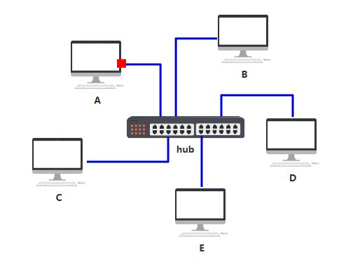
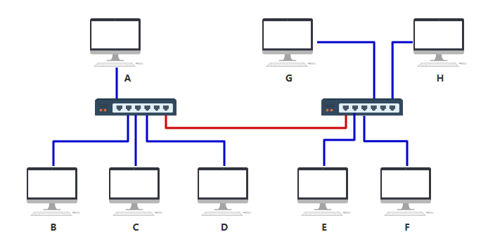
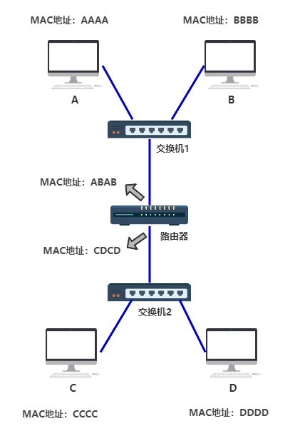
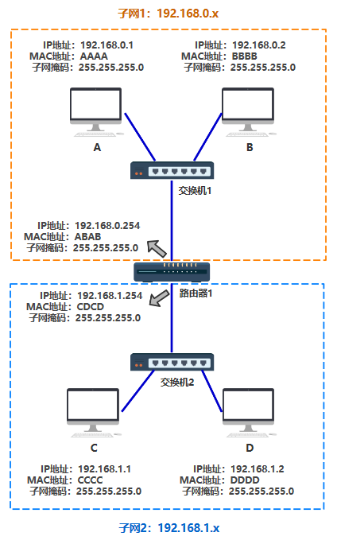
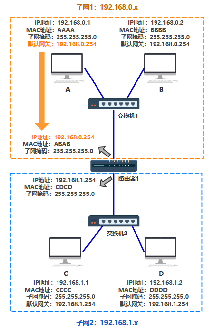
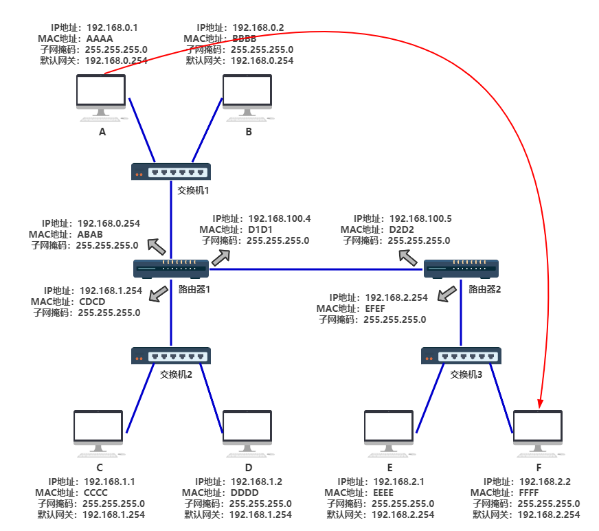
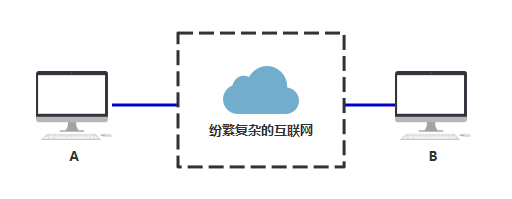
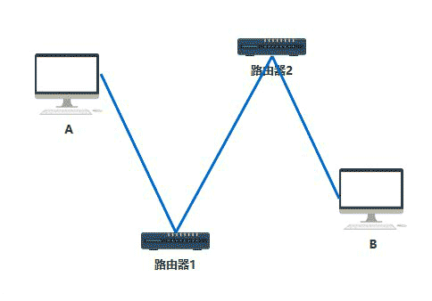
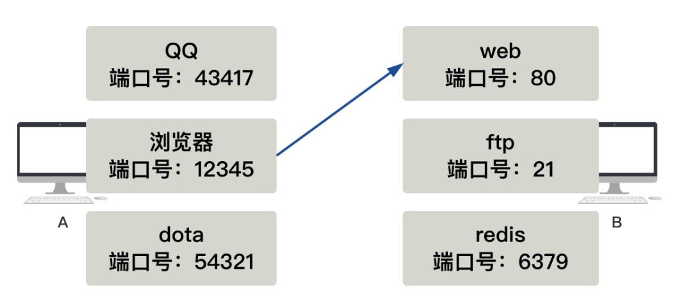
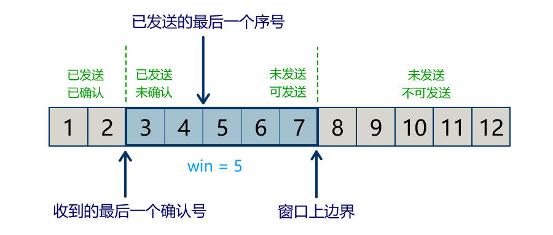

# 简单说网络

在我们的家中有许多网络设备，电脑、手机、电视机……，它们都连接到了路由器上，并且浏览器通过运营商线路接入了因特网。

这里面有许多的使用场景，比如：利用电脑上网学习，手机给电脑发送文件，电脑视频在电视机上共享播放，用手机控制电视机，在家中通过 VPN 连接到公司内网进行工作等，而这一切都脱离不了计算机网络。

简单说网络，通过通俗易懂的解释，带你入门计算机网络。

## 一、初始基本网络模型

每个能上网的设备都有一个**网卡**，网卡可以通过有线或无线的方式连接到计算机网络，每个网卡出厂时都具有一个全世界**独一无二**的 **MAC 地址**，这个 MAC 地址是根据一定规则制定的。

由于 MAC 地址是独一无二的，所以我们的网络设备就可以通过 MAC 地址在全世界唯一的标识自己。

当 `计算机 A` 想要与 `计算机 B` 通讯时，只需要知道对方的 MAC 地址，就可以在计算机网络中寻找到对方。具体方式是通过**广播**，当 `计算机 A` 要发送数据给 `计算机 B` 时，就将 `自己的 MAC 地址` + `对方的 MAC 地址` + `数据` 组成一个数据包发送到所在网络中（广播），所有该网络中的计算机都接收到该数据包，但是只有 `计算机 B` 收到后知道是和自己通讯的（通过验证 MAC 地址），所以会做出响应，而其他计算机则会直接丢弃该数据包，不做响应。

`计算机 A` 是通过网线与 `计算机 B` 相连的，假如 `计算机 A` 与 `计算机 B` 之间的距离超过 100 米，那么目前的网线（双绞线）是无法进行通讯的，因为双绞线的最远传输距离 <=100 米，实际情况可能更低，所以必须在网线与网线之间利用**中继器**进行信号（物理信号）的整形和放大，以延长网线的传输距离，当然中继器的使用次数也是有限制的（以太网标准的规定）。

如果计算机数量多到十多台或是几十台，那么为了实现任何两台计算机之间都能够相互通讯而在任意两台计算机之间都用网线相连那是不可能的，因为太浪费网线，并且管理也不方便，故障率也会很高。所以就出现了**集线器（Hub）**。集线器本质上就是一个拥有许多连接端口的中继器，它可以把周围的计算机的网线都连接到自己身上，让自身成为中心点，每当有数据到达，就由它统一负责广播到各个接口（复制多份，转发到各个端口），以到达每台计算机都相连的目的，同时它还与中继器一样具有对信号的整形和放大能力。

但是集线器有一个严重的问题，因为它只是单纯的作为一个中心点连接每一台计算机，它无法识别每一次通讯的目标 MAC 是要从哪个端口发出，也就是说，计算机们相互通讯的数据是没有在集线器中区分开的，都是汇聚到一点，然后广播到各个接口，所以当同时通讯的计算机比较多时，集线器总线上可用的带宽就需要被瓜分给各条通讯，这样每条通讯的实际所用带宽都比较小，通讯效率很低，并且数据随意广播到其他非目标计算机也造成了流量的浪费，以及严重的安全隐患。

为了解决集线器的缺陷，**交换机（Switch）**诞生了（注意：此处指的是二层交换机（没有路由功能的交换机））。

交换机各个端口分别有一条独立的交换信道，不是共享一条背板总线。同时，交换机是智能的，交换机可以获取与其连接设备的物理地址，并将其物理地址（MAC 地址）与端口的映射关系记录在一张一直在动态更新的表上，当有数据包发送到交换机时，交换机会根据其目标 MAC 地址查询表中是否记录了其对应的出口端口是谁，如果有，就直接发送到出口端口上，如果找不到，就广播到各个端口。

当然，这张表是需要一定的规则来进行维护的，具体的规则是：

刚开始，交换机的地址表还没有保存任何的 MAC 地址记录，当某台计算机首次发送数据包，这个数据包经过交换机时，交换机才会保存记录，记录我们的发送方的 MAC 地址以及 MAC 地址对应的传入端口，如此多次的，局域网中的所有主机的 MAC 地址在表中都会有记录了，同时，长期没有使用过的记录会被自动清除。

> 其实在交换机之前还有**网桥**，它的功能与交换机差不多，但是它只有两个端口，所以已经被交换机取代。

集线器与交换机都是工作在局域网中的设备，集线器属于一层设备（物理层）与物理信号打交道，交换机属于二层设备（数据链路层）与 MAC 地址打交道。

但是，随着互联网越来越大，全世界计算机设备数不胜数（电脑、手机、智能家电、公共摄像头、各种终端设备），MAC 地址还没有规律，如果我们还利用 MAC 地址的方式找对方，那么效率极低，肯定不现实，所以就出现了 **IP 地址**。

> 在局域网中还是使用 MAC 地址的方式找对方，只是在广阔的互联网中，就需要 IP 地址了！

IP 地址本质上就是将各种计算机进行区间划分，划分在一个一个的网络中。找计算机时，先找网络，再在具体网络中找计算机，好让寻找的范围大大缩小。

当 `计算机 A` 想要和 `计算机 B` 通讯时，只需要知道 `计算机 B` 的 IP 地址，那么就会借助一台一台的**路由器（Router）**在计算机网络中根据 IP 地址找到 `计算机 B` 所在的具体网络。

顾名思义，路由器是一种根据 IP 地址，在不同网络中传送数据的设备，它属于三层设备（网络层）与 IP 地址打交道。

路由器接受到一个数据包时，会根据 IP 地址判断该数据是送给本网络的还是其他网络的，如果是本网络，路由器就会接受该数据并送回，如果是其他网络，那么路由器会根据路由表（根据路由协议维护）发送到其他端口（下一跳路由器），这样反反复复，直到找到目标网络。

所以说，路由器本质上也就充当了**网关（Gateway）**（可以理解为网络关卡）。

通常情况下，一个局域网中会有许多台设备，所以先把设备连接到交换机，交换机再连接到路由器。

当然，如果只有一台设备，可以直接连接到路由器。

这里展示一个简单的互联网数据传输示意图：

简单概况：集线器或交换机被用来创建网络，而路由器被用来连接网络！

## 二、深入基本网络模型

你是一台电脑，你的名字叫 A

很久很久之前，你不与任何其他电脑相连接，孤苦伶仃。

直到有一天，你希望与另一台电脑 B 建立通信，于是你们各开了一个网口，用一根**网线**连接了起来。

用一根网线连接起来怎么就能"通信"了呢？我可以给你讲 IO、讲中断、讲缓冲区，但这不是研究网络时该关心的问题。

如果你纠结，要么去研究一下操作系统是如何处理网络 IO 的，要么去研究一下包是如何被网卡转换成电信号发送出去的，要么就仅仅把它当做电脑里有个小人在**开枪**吧~

反正，你们就是连起来了，并且可以通信。

**第一层**

有一天，一个新伙伴 C 加入了，但聪明的你们很快发现，可以每个人开**两个网口**，用一共**三根网线**，彼此相连。

随着越来越多的人加入，你发现身上开的网口实在太多了，而且网线密密麻麻，混乱不堪。（而实际上一台电脑根本开不了这么多网口，所以这种连线只在理论上可行，所以连不上的我就用红色虚线表示了，就是这么严谨哈哈~）

于是你们发明了一个中间设备，你们将网线都插到这个设备上，由这个设备做转发，就可以彼此之间通信了，本质上和原来一样，只不过网口的数量和网线的数量减少了，不再那么混乱。

你给它取名叫**集线器**，它仅仅是无脑将电信号**转发到所有出口（广播）**，不做任何处理，你觉得它是没有智商的，因此把人家定性在了**物理层**。

由于转发到了所有出口，那 BCDE 四台机器怎么知道数据包是不是发给自己的呢？

首先，你要给所有的连接到集线器的设备，都起个名字。原来你们叫 ABCD，但现在需要一个更专业的，**全局唯一**的名字作为标识，你把这个更高端的名字称为 **MAC 地址**。

你的 MAC 地址是 aa-aa-aa-aa-aa-aa，你的伙伴 b 的 MAC 地址是 bb-bb-bb-bb-bb-bb，以此类推，不重复就好。

这样，A 在发送数据包给 B 时，只要在头部拼接一个这样结构的数据，就可以了。

B 在收到数据包后，根据头部的目标 MAC 地址信息，判断这个数据包的确是发给自己的，于是便**收下**。

其他的 CDE 收到数据包后，根据头部的目标 MAC 地址信息，判断这个数据包并不是发给自己的，于是便**丢弃**。

虽然集线器使整个布局干净不少，但原来我只要发给电脑 B 的消息，现在却要发给连接到集线器中的所有电脑，这样既不安全，又不节省网络资源。

**第二层**

如果把这个集线器弄得更智能一些，**只发给目标 MAC 地址指向的那台电脑**，就好了。

虽然只比集线器多了这一点点区别，但看起来似乎有智能了，你把这东西叫做**交换机**。也正因为这一点点智能，你把它放在了另一个层级，**数据链路层**。

如上图所示，你是这样设计的。

交换机内部维护一张 **MAC 地址表**，记录着每一个 MAC 地址的设备，连接在其哪一个端口上。

|     MAC 地址      | 端口 |
| :---------------: | :--: |
| bb-bb-bb-bb-bb-bb |  1   |
| cc-cc-cc-cc-cc-cc |  3   |
| aa-aa-aa-aa-aa-aa |  4   |
| dd-dd-dd-dd-dd-dd |  5   |

假如你仍然要发给 B 一个数据包，构造了如下的数据结构从网口出去。

到达交换机时，交换机内部通过自己维护的 MAC 地址表，发现**目标机器 B 的 MAC 地址 bb-bb-bb-bb-bb-bb 映射到了端口 1 上**，于是把数据从 1 号端口发给了 B，完事~

你给这个通过这样传输方式而组成的小范围的网络，叫做**以太网**。

当然最开始的时候，MAC 地址表是空的，是怎么逐步建立起来的呢？

假如在 MAC 地址表为空是，你给 B 发送了如下数据

由于这个包从端口 4 进入的交换机，所以此时交换机就可以在 MAC地址表记录第一条数据：

**MAC：aa-aa-aa-aa-aa-aa-aa
端口：4**

交换机看目标 MAC 地址（bb-bb-bb-bb-bb-bb）在地址表中并没有映射关系，于是将此包发给了**所有端口**，也即发给了所有机器。

之后，只有机器 B 收到了确实是发给自己的包，于是做出了**响应**，响应数据从端口 1 进入交换机，于是交换机此时在地址表中更新了第二条数据：

**MAC：bb-bb-bb-bb-bb-bb
端口：1**

过程如下

经过该网络中的机器不断地通信，交换机最终将 MAC 地址表建立完毕~

随着机器数量越多，交换机的端口也不够了，但聪明的你发现，只要将多个交换机连接起来，这个问题就轻而易举搞定~

你完全不需要设计额外的东西，只需要按照之前的设计和规矩来，按照上述的接线方式即可完成所有电脑的互联，所以交换机设计的这种规则，真的很巧妙。你想想看为什么（比如 A 要发数据给 F）。

但是你要注意，上面那根红色的线，最终在 MAC 地址表中可不是一条记录呀，而是要把 EFGH 这四台机器与该端口（端口6）的映射全部记录在表中。

最终，**两个交换机将分别记录 A ~ H 所有机器的映射记录**。

**左边的交换机**

|     MAC 地址      | 端口 |
| :---------------: | :--: |
| bb-bb-bb-bb-bb-bb |  1   |
| cc-cc-cc-cc-cc-cc |  3   |
| aa-aa-aa-aa-aa-aa |  4   |
| dd-dd-dd-dd-dd-dd |  5   |
| ee-ee-ee-ee-ee-ee |  6   |
| ff-ff-ff-ff-ff-ff |  6   |
| gg-gg-gg-gg-gg-gg |  6   |
| hh-hh-hh-hh-hh-hh |  6   |

**右边的交换机**

|     MAC 地址      | 端口 |
| :---------------: | :--: |
| bb-bb-bb-bb-bb-bb |  1   |
| cc-cc-cc-cc-cc-cc |  1   |
| aa-aa-aa-aa-aa-aa |  1   |
| dd-dd-dd-dd-dd-dd |  1   |
| ee-ee-ee-ee-ee-ee |  2   |
| ff-ff-ff-ff-ff-ff |  3   |
| gg-gg-gg-gg-gg-gg |  4   |
| hh-hh-hh-hh-hh-hh |  6   |

这在只有 8 台电脑的时候还好，甚至在只有几百台电脑的时候，都还好，所以这种交换机的设计方式，已经足足支撑一阵子了。

但很遗憾，人是贪婪的动物，很快，电脑的数量就发展到几千、几万、几十万。

**第三层**

交换机已经无法记录如此庞大的映射关系了。

此时你动了歪脑筋，你发现了问题的根本在于，连出去的那根红色的网线，后面不知道有多少个设备不断地连接进来，从而使得地址表越来越大。

那我可不可以让那根红色的网线，接入一个**新的设备**，这个设备就跟电脑一样有自己独立的 MAC 地址，而且同时还能帮我把数据包做一次**转发**呢？

这个设备就是**路由器，**它的功能就是，作为一台独立的拥有 MAC 地址的设备，并且可以帮我把数据包做一次转发**，**你把它定在了**网络层。**

注意，路由器的每一个端口，都有独立的 MAC 地址。

好了，现在交换机的 MAC 地址表中，只需要多出一条 MAC 地址 ABAB 与其端口的映射关系，就可以成功把数据包转交给路由器了，这条搞定。

那如何做到，把发送给 C 和 D，甚至是把发送给 DEFGH.... 的数据包，统统先发送给路由器呢？

不难想到这样一个点子，假如电脑 C 和 D 的 MAC 地址拥有共同的前缀，比如分别是

**C 的 MAC 地址：FFFF-FFFF-CCCC**

**D 的 MAC 地址：FFFF-FFFF-DDDD**

那我们就可以说，将目标 MAC 地址为 **FFFF-FFFF-？开头的**，统统先发送给路由器。

这样是否可行呢？答案是否定的。

我们先从现实中 MAC 地址的结构入手，MAC地址也叫物理地址、硬件地址，长度为 48 位，一般这样来表示

**00-16-EA-AE-3C-40**

它是由网络设备制造商生产时烧录在网卡的EPROM（一种闪存芯片，通常可以通过程序擦写）。其中**前 24 位（00-16-EA）代表网络硬件制造商的编号**，后 24 位（AE-3C-40）是该厂家自己分配的，一般表示系列号。**只要不更改自己的 MAC 地址，MAC 地址在世界是唯一的。形象地说，MAC地址就如同身份证上的身份证号码，具有唯一性。

那如果你希望向上面那样表示将目标 MAC 地址为 **FFFF-FFFF-？开头的**，统一从路由器出去发给某一群设备（后面会提到这其实是子网的概念），那你就需要要求某一子网下统统买一个厂商制造的设备，要么你就需要要求厂商在生产网络设备烧录 MAC 地址时，提前按照你规划好的子网结构来定 MAC 地址，并且日后这个网络的结构都不能轻易改变。

这显然是不现实的。

于是你发明了一个新的地址，给每一台机器一个 32 位的编号，如：

**11000000101010000000000000000001**

你觉得有些不清晰，于是把它分成四个部分，中间用点相连。

**11000000.10101000.00000000.00000001**

你还觉得不清晰，于是把它转换成 10 进制。

**192.168.0.1**

最后你给了这个地址一个响亮的名字，**IP 地址**。现在每一台电脑，同时有自己的 MAC 地址，又有自己的 IP 地址，只不过 IP 地址是**软件层面**上的，可以随时修改，MAC 地址一般是无法修改的。

这样一个可以随时修改的 IP 地址，就可以根据你规划的网络拓扑结构，来调整了。

如上图所示，假如我想要发送数据包给 ABCD 其中一台设备，不论哪一台，我都可以这样描述，**"将 IP 地址为 192.168.0 开头的全部发送给到路由器，之后再怎么转发，交给它！"**，巧妙吧。

那交给路由器之后，路由器又是怎么把数据包准确转发给指定设备的呢？

别急我们慢慢来。

我们先给上面的组网方式中的每一台设备，加上自己的 IP 地址

现在两个设备之间传输，除了加上数据链路层的头部之外，还要再增加一个网络层的头部。

假如 A 给 B 发送数据，由于它们直接连着交换机，所以 A 直接发出如下数据包即可，其实网络层没有体现出作用。

但假如 A 给 C 发送数据，A 就需要先转交给路由器，然后再由路由器转交给 C。由于最底层的传输仍然需要依赖以太网，所以数据包是分成两段的。

A ~ 路由器这段的包如下：

路由器到 C 这段的包如下：

好了，上面说的两种情况（A->B，A->C），相信细心的读者应该会有不少疑问，下面我们一个个来展开。

**【A 给 C 发数据包，怎么知道是否要通过路由器转发呢？】**

**答案：子网**

如果源 IP 与目的 IP 处于一个子网，直接将包通过交换机发出去。

如果源 IP 与目的 IP 不处于一个子网，就交给路由器去处理。

好，那现在只需要解决，什么叫处于一个子网就好了。

- 192.168.0.1 和 192.168.0.2 处于同一个子网
- 192.168.0.1 和 192.168.1.1 处于不同子网

这两个是我们人为规定的，即我们想表示，对于 192.168.0.1 来说：

**192.168.0.xxx 开头的，就算是在一个子网，否则就是在不同的子网。**

那对于计算机来说，怎么表达这个意思呢？于是人们发明了**子网掩码**的概念

假如某台机器的子网掩码定为 255.255.255.0

这表示，将源 IP 与目的 IP 分别同这个子网掩码进行**与运算**，相等则是在一个子网，不相等就是在不同子网，就这么简单。

比如

- **A电脑**：192.168.0.1 & 255.255.255.0 = 192.168.0.0
- **B电脑**：192.168.0.2 & 255.255.255.0 = 192.168.0.0
- **C电脑**：192.168.1.1 & 255.255.255.0 = 192.168.1.0
- **D电脑**：192.168.1.2 & 255.255.255.0 = 192.168.1.0

那么 A 与 B 在同一个子网，C 与 D 在同一个子网，但是 A 与 C 就不在同一个子网，与 D 也不在同一个子网，以此类推。

所以如果 A 给 C 发消息，A 和 C 的 IP 地址分别 & A 机器配置的子网掩码，发现不相等，则 A 认为 C 和自己不在同一个子网，于是把包发给路由器，就不管了，**之后怎么转发，A 不关心**。

**【A 如何知道，哪个设备是路由器？】**

**答案：在 A 上要设置默认网关**

上一步 A 通过是否与 C 在同一个子网内，判断出自己应该把包发给路由器，那路由器的 IP 是多少呢？

其实说发给路由器不准确，应该说 A 会把包发给**默认网关**。

对 A 来说，A 只能**直接**把包发给同处于一个子网下的某个 IP 上，所以发给路由器还是发给某个电脑，对 A 来说也不关心，只要这个设备有个 IP 地址就行。

所以**默认网关，就是 A 在自己电脑里配置的一个 IP 地址**，以便在发给不同子网的机器时，发给这个 IP 地址。

仅此而已！

**【路由器如何知道C在哪里？】**

**答案：路由表**

现在 A 要给 C 发数据包，已经可以成功发到路由器这里了，最后一个问题就是，**路由器怎么知道，收到的这个数据包，该从自己的哪个端口出去**，才能直接（或间接）地最终到达目的地 C 呢。

路由器收到的数据包有目的 IP 也就是 C 的 IP 地址，需要转化成从自己的哪个端口出去，很容易想到，应该有个表，就像 MAC 地址表一样。

这个表就叫**路由表**。

至于这个路由表是怎么出来的，有很多路由算法（RIP、OSPF、BGP……），本文不展开~

不同于 MAC 地址表的是，路由表并不是一对一这种明确关系，我们下面看一个路由表的结构。

|   目的地址    |    子网掩码     | 下一跳 | 端口 |
| :-----------: | :-------------: | :----: | :--: |
|  192.168.0.0  |  255.255.255.0  |        |  0   |
| 192.168.0.254 | 255.255.255.255 |        |  0   |
|  192.168.1.0  |  255.255.255.0  |        |  1   |
| 192.168.1.254 | 255.255.255.255 |        |  1   |

我们学习一种新的表示方法，由于子网掩码其实就表示前多少位表示子网的网段，所以如 192.168.0.0（255.255.255.0） 也可以简写为 192.168.0.0/24

|     目的地址     | 下一跳 | 端口 |
| :--------------: | :----: | :--: |
|  192.168.0.0/24  |        |  0   |
| 192.168.0.254/32 |        |  0   |
|  192.168.1.0/24  |        |  1   |
| 192.168.1.254/32 |        |  1   |

这就很好理解了，路由表就表示，**192.168.0.xxx 这个子网下的，都转发到 0 号端口，192.168.1.xxx 这个子网下的，都转发到 1 号端口**。下一跳列还没有值，我们先不管

配合着结构图来看（这里把子网掩码和默认网关都补齐了）图中 & 笔误，结果应该是 .0

**【刚才说的都是 IP 层，但发送数据包的数据链路层需要知道 MAC 地址，可是我只知道 IP 地址该怎么办呢？】**

**答案：arp**

假如你（A）此时**不知道**你同伴 B 的 MAC 地址（现实中就是不知道的，刚刚我们只是假设已知），你只知道它的 IP 地址，你该怎么把数据包准确传给 B 呢？

答案很简单，在网络层，**我需要把 IP 地址对应的 MAC 地址找到**，也就是通过某种方式，找到 **192.168.0.2** 对应的 MAC 地址 **BBBB**。

这种方式就是 **arp 协议**，同时电脑 A 和 B 里面也会有一张 **arp 缓存表**，表中记录着 **IP 与 MAC 地址**的对应关系。

|   IP 地址   | MAC 地址 |
| :---------: | :------: |
| 192.168.0.2 |   BBBB   |

一开始的时候这个表是**空的**，电脑 A 为了知道电脑 B（192.168.0.2）的 MAC 地址，将会**广播**一条 arp 请求，B 收到请求后，带上自己的 MAC 地址给 A 一个**响应**。此时 A 便更新了自己的 arp 表。

这样通过大家不断广播 arp 请求，最终所有电脑里面都将 arp 缓存表更新完整。

**总结一下**

好了，总结一下，到目前为止就几条规则

**从各个节点的视角来看**

**电脑视角：**

- 首先我要知道我的 IP 以及对方的 IP（当然也知道默认网关的 IP）
- 通过子网掩码判断我们是否在同一个子网
- 在同一个子网就通过 arp 获取对方 mac 地址直接扔出去
- 不在同一个子网就通过 arp 获取默认网关的 mac 地址直接扔出去

**交换机视角：**

- 我收到的数据包必须有目标 MAC 地址
- 通过 MAC 地址表查映射关系
- 查到了就按照映射关系从我的指定端口发出去
- 查不到就所有端口都发出去

**路由器视角：**

- 我收到的数据包必须有目标 IP 地址
- 通过路由表查映射关系
- 查到了就按照映射关系从我的指定端口发出去（不在任何一个子网范围，注意：走其路由器的默认网关也算查到了）
- 查不到则返回一个路由不可达的数据包

如果你嗅觉足够敏锐，你应该可以感受到下面这句话：

网络层（IP协议）本身没有传输包的功能，包的实际传输是委托给数据链路层（以太网中的交换机）来实现的。

**涉及到的三张表分别是**

- 交换机中有 **MAC 地址**表用于映射 MAC 地址和它的端口
- 路由器中有**路由表**用于映射 IP 地址(段)和它的端口
- 电脑和路由器中都有 **arp 缓存表**用于缓存 IP 和 MAC 地址的映射关系

**这三张表是怎么来的**

- MAC 地址表是通过以太网内各节点之间不断通过交换机通信，不断完善起来的。
- 路由表是各种路由算法 + 人工配置逐步完善起来的。
- arp 缓存表是不断通过 arp 协议的请求逐步完善起来的。

知道了以上这些，目前网络上两个节点是如何发送数据包的这个过程，就完全可以解释通了！

那接下来我们就放上本章 **最后一个** 网络拓扑图吧，请做好 **战斗** 准备！

这时路由器 1 连接了路由器 2，所以其路由表有了下一条地址这一个概念，所以它的路由表就变成了这个样子。如果匹配到了有下一跳地址的一项，则需要再次匹配，找到其端口，并找到下一跳 IP 的 MAC 地址。

也就是说找来找去，最终必须能映射到一个端口号，然后从这个端口号把数据包发出去。

|     目的地址     |    下一跳     | 端口 |
| :--------------: | :-----------: | :--: |
|  192.168.0.0/24  |               |  0   |
| 192.168.0.254/32 |               |  0   |
|  192.168.1.0/24  |               |  1   |
| 192.168.1.254/32 |               |  1   |
|  192.168.2.0/24  | 192.168.100.5 |      |
| 192.168.100.0/24 |               |  2   |
| 192.168.100.4/32 |               |  2   |

**这时如果 A 给 F 发送一个数据包，能不能通呢？如果通的话整个过程是怎样的呢？**

思考一分钟……

**详细过程动画描述：**

**详细过程文字描述：**

**1.** 首先 A（192.168.0.1）通过子网掩码（255.255.255.0）计算出自己与 F（192.168.2.2）并不在同一个子网内，于是决定发送给默认网关（192.168.0.254）。

**2.** A 通过 ARP 找到 默认网关 192.168.0.254 的 MAC 地址。

**3.** A 将源 MAC 地址（AAAA）与网关 MAC 地址（ABAB）封装在数据链路层头部，又将源 IP 地址（192.168.0.1）和目的 IP 地址（192.168.2.2）（注意这里千万不要以为填写的是默认网关的 IP 地址，从始至终这个数据包的两个 IP 地址都是不变的，只有 MAC 地址在不断变化）封装在网络层头部，然后发包。

**4.** 交换机 1 收到数据包后，发现目标 MAC 地址是 ABAB，转发给路由器1。

**5.** 数据包来到了路由器 1，发现其目标 IP 地址是 192.168.2.2，查看其路由表，发现了下一跳的地址是 192.168.100.5。

**6.** 所以此时路由器 1 需要做两件事，第一件是再次匹配路由表，发现匹配到了端口为 2，于是将其封装到数据链路层，最后把包从 2 号口发出去。

**7.** 此时路由器 2 收到了数据包，看到其目的地址是 192.168.2.2，查询其路由表，匹配到端口号为 1，准备从 1 号口把数据包送出去。

**8.** 但此时路由器 2 需要知道 192.168.2.2 的 MAC 地址了，于是查看其 arp 缓存（如果找不到，那么就用 arp 协议广播获取），找到其 MAC 地址为 FFFF，将其封装在数据链路层头部，并从 1 号端口把包发出去。

**9.** 交换机 3 收到了数据包，发现目的 MAC 地址为 FFFF，查询其 MAC 地址表，发现应该从其 6 号端口出去，于是从 6 号端口把数据包发出去。

**10.** **F 最终收到了数据包！**并且发现目的 MAC 地址就是自己，于是收下了这个包。

## 三、了解 UDP、TCP

**你是一台电脑，你的名字叫 A**

经过上一章的一番折腾，只要你知道另一位伙伴 B 的 IP 地址，且你们之间的网络是通的，无论多远，你都可以将一个数据包发送给你的伙伴 B

这就是物理层、数据链路层、网络层这三层所做的事情。

站在第四层的你，就可以不要脸地利用下三层所做的铺垫，随心所欲地发送数据，而不必担心找不到对方了。

虽然你此时还什么都没干，但你还是给自己这一层起了个响亮的名字，叫做**传输层**。

你本以为自己所在的第四层万事大吉，啥事没有，但很快问题就接踵而至。

**【问题来了】**   

前三层协议只能把数据包从一个主机搬到另外一台主机，但是，到了目的地以后，数据包具体交给哪个**程序**（进程）呢？

所以，你需要把通信的进程区分开来，于是就给每个进程分配一个数字编号，你给它起了一个响亮的名字：**端口号**。

然后你在要发送的数据包上，增加了传输层的头部，**源端口号**与**目标端口号**。

OK，这样你将原本主机到主机的通信，升级为了**进程和进程之间的通信**。

你没有意识到，你不知不觉实现了 **UDP 协议**！

（当然 UDP 协议中不光有源端口和目标端口，还有数据包长度和校验值，我们暂且略过）

就这样，你用 UDP 协议无忧无虑地同 B 进行着通信，一直没发生什么问题。

但很快，你发现事情变得非常复杂......

**【丢包问题】**

由于网络的不可靠，数据包可能在半路丢失，而 A 和 B 却无法察觉。

> 由于 UDP 协议会发生丢包，所以 UDP 是面向不可靠的传输协议，比较适用于对效率及速度有较高要求，而对数据是否完整没有特别要求的场景，比如：视频、音频、直播……
>
> 而接下来就将讨论面向可靠的传输协议 TCP。

对于丢包问题，只要解决两个事就好了。

**第一个，A 怎么知道包丢了？**

答案：让 B 告诉 A

**第二个，丢了的包怎么办？**

答案：重传

于是你设计了如下方案，A 每发一个包，都必须收到来自 B 的**确认**（ACK），再发下一个，否则在一定时间内没有收到确认，就**重传**这个包。

你管它叫**停止等待协议**。只要按照这个协议来，虽然 A 无法保证 B 一定能收到包，但 A 能够确认 B 是否收到了包，收不到就重试，尽最大努力让这个通信过程变得可靠，于是你们现在的通信过程又有了一个新的特征，**可靠交付**。

**【效率问题】**

停止等待虽然能解决问题，但是效率太低了，A 原本可以在发完第一个数据包之后立刻开始发第二个数据包，但由于停止等待协议，A 必须等数据包到达了 B ，且 B 的 ACK 包又回到了 A，才可以继续发第二个数据包，这效率慢得可不是一点两点。

于是你对这个过程进行了改进，采用**流水线**的方式，不再傻傻地等。

**【顺序问题】**   

但是网路是复杂的、不可靠的。

有的时候 A 发出去的数据包，分别走了不同的路由到达 B，可能无法保证和发送数据包时一样的顺序。

在流水线中有多个数据包和 ACK 包在**乱序流动**，他们之间对应关系就乱掉了。

难道还回到停止等待协议？A 每收到一个包的确认（ACK）再发下一个包，那就根本不存在顺序问题。应该有更好的办法！

A 在发送的数据包中增加一个**序号**（seq），同时 B 要在 ACK 包上增加一个**确认号**（ack），这样不但解决了停止等待协议的效率问题，也通过这样标序号的方式解决了顺序问题。

而 B 这个确认号意味深长：比如 B 发了一个确认号为 ack = 3，它不仅仅表示 A 发送的序号为 2 的包收到了，还表示 2 之前的数据包都收到了。这种方式叫**累计确认**或**累计应答**。

注意，实际上 ack 的号是收到的最后一个数据包的序号 seq + 1，也就是告诉对方下一个应该发的序号是多少。但图中为了便于理解，ack 就表示收到的那个序号，不必纠结。

**【流量问题】** 

有的时候，A 发送数据包的速度太快，而 B 的接收能力不够，但 B 却没有告知 A 这个情况。

怎么解决呢？

很简单，B 告诉 A 自己的接收能力，A 根据 B 的接收能力，相应控制自己的**发送速率**，就好了。

B 怎么告诉 A 呢？B 跟 A 说"我很强"这三个字么？那肯定不行，得有一个严谨的规范。

于是 B 决定，每次发送数据包给 A 时，顺带传过来一个值，叫**窗口大小**（win)，这个值就表示 B 的**接收能力**。同理，每次 A 给 B 发包时也带上自己的窗口大小，表示 A 的接收能力。

B 告诉了 A 自己的窗口大小值，A 怎么利用它去做 A 这边发包的流量控制呢？

很简单，假如 B 给 A 传过来的窗口大小 win = 5，那 A 根据这个值，把自己要发送的数据分成这么几类。

图片过于清晰，就不再文字解释了。

当 A 不断发送数据包时，**已发送的最后一个序号**就往右移动，直到碰到了窗口的上边界，此时 A 就无法继续发包，达到了流量控制。

但是当 A 不断发包的同时，A 也会收到来自 B 的确认包，此时**整个窗口**会往右移动，因此上边界也往右移动，A 就能发更多的数据包了。

以上都是在窗口大小不变的情况下，而 B 在发给 A 的 ACK 包中，每一个都可以**重新设置**一个新的窗口大小，如果 A 收到了一个新的窗口大小值，A 会随之调整。

如果 A 收到了比原窗口值更大的窗口大小，比如 win = 6，则 A 会直接将窗口上边界向右移动 1 个单位。

如果 A 收到了比原窗口值小的窗口大小，比如 win = 4，则 A 暂时不会改变窗口大小，更不会将窗口上边界向左移动，而是等着 ACK 的到来，不断将左边界向右移动，直到窗口大小值收缩到新大小为止。

OK，终于将流量控制问题解决得差不多了，你看着上面一个个小动图，给这个窗口起了一个更生动的名字，**滑动窗口**。

**【拥塞问题】**  

但有的时候，不是 B 的接受能力不够，而是网络不太好，造成了**网络拥塞**。

拥塞控制与流量控制有些像，但流量控制是受 B 的接收能力影响，而拥塞控制是受**网络环境**的影响。

拥塞控制的解决办法依然是通过设置一定的窗口大小，只不过，流量控制的窗口大小是 B 直接告诉 A 的，而拥塞控制的窗口大小按理说就应该是网络环境主动告诉 A。

但网络环境怎么可能主动告诉 A 呢？只能 A 单方面通过**试探**，不断感知网络环境的好坏，进而确定自己的拥塞窗口的大小。

拥塞窗口大小的计算有很多复杂的算法，就不在本文中展开了，假如**拥塞窗口的大小为  cwnd**，上一部分流量控制的**滑动窗口的大小为 rwnd**，那么窗口的右边界受这两个值共同的影响，需要取它俩的最小值。

**窗口大小 = min(cwnd, rwnd)**

含义很容易理解，当 B 的接受能力比较差时，即使网络非常通畅，A 也需要根据 B 的接收能力限制自己的发送窗口。当网络环境比较差时，即使 B 有很强的接收能力，A 也要根据网络的拥塞情况来限制自己的发送窗口。正所谓受其**短板**的影响嘛~

**【连接问题】**   

有的时候，B 主机的相应进程还没有准备好或是挂掉了，A 就开始发送数据包，导致了浪费。

这个问题在于，A 在跟 B 通信之前，没有事先确认 B 是否已经准备好，就开始发了一连串的信息。就好比你和另一个人打电话，你还没有"喂"一下确认对方有没有在听，你就巴拉巴拉说了一堆。

这个问题该怎么解决呢？

地球人都知道，**三次握手**嘛！

A：我准备好了(SYN)

B：我知道了(ACK)，我也准备好了(SYN)

A：我知道了(ACK)

A 与 B 各自在内存中维护着自己的状态变量，三次握手之后，双方的状态都变成了**连接已建立**（ESTABLISHED）。

虽然就只是发了三次数据包，并且在各自的内存中维护了状态变量，但这么说总觉得太 low，你看这个过程相当于双方建立连接的过程，于是你灵机一动，就叫它**面向连接**吧。

注意：这个连接是虚拟的，是由 A 和 B 这两个终端共同维护的，在网络中的设备根本就不知道连接这回事儿！

但凡事有始就有终，有了建立连接的过程，就要考虑释放连接的过程，又是地球人都知道，**四次挥手**嘛！

A：再见，我要关闭了(FIN)

B：我知道了(ACK)

   给 B 一段时间把自己的事情处理完...

B：再见，我要关闭了(FIN)

A：我知道了(ACK)

**【总结】**

以上讲述的，就是 TCP 协议的核心思想，上面过程中需要传输的信息，就体现在 TCP 协议的头部，这里放上最常见的 TCP 协议头解读的图。

不知道你现在再看下面这句话，是否能理解：

**TCP 是**

**面向连接的、可靠的、基于字节流的**

**传输层通信协议**

面向连接、可靠，这两个词通过上面的讲述很容易理解，那什么叫做基于字节流呢？

很简单，TCP 在建立连接时，需要告诉对方 MSS（最大报文段大小）。

也就是说，如果要发送的数据很大，在 TCP 层是需要按照 MSS 来切割成一个个的 **TCP 报文段** 的。

切割的时候我才不管你原来的数据表示什么意思，需要在哪里断句啥的，我就把它当成一串毫无意义的字节，在我想要切割的地方咔嚓就来一刀，标上序号，只要接收方再根据这个序号拼成最终想要的完整数据就行了。

在我 TCP 传输这里，我就把它当做一个个的**字节**，也就是基于字节流的含义了。

最后留给大家一个作业，模拟 A 与 B 建立一个 TCP 连接。

**第一题**：A 给 B 发送 "aaa" ，然后 B 给 A 回复一个简单的字符串 "success"，并将此过程抓包。

**第二题**：A 给 B 发送 "aaaaaa ... a" 超过最大报文段大小，然后 B 给 A 回复一个简单的字符串 "success"，并将此过程抓包。

下面是我抓的包（第二题）

> URG：标识紧急指针是否有效
>
> ACK：标识确认序号是否有效
>
> PSH：用来提示接收端应用程序立刻将数据从 tcp 缓冲区读走
>
> RST：要求重新建立连接，我们把含有 RST 标识的报文称为复位报文段
>
> SYN：请求建立连接，我们把含有 SYN 标识的报文称为同步报文段
>
> FIN：通知对端，本端即将关闭，我们把含有 FIN 标识的报文称为结束报文段

**三次握手阶段**

A -> B [SYN] Seq=0 Win=64240 Len=0

​            MSS=1460 WS=256

B - >A [SYN, ACK] Seq=0 Ack=1 Win=29200 Len=0

​            MSS=1424 WS=512

A -> B [ACK] Seq=1 Ack=1 Win=132352 Len=0

**数据发送阶段**

A -> B [ACK] Seq=1 Ack=1 Win=132352 Len=1424

A -> B [ACK] Seq=1425 Ack=1 Win=132352 Len=1424

A -> B [PSH, ACK] Seq=2849 Ack=1 Win=132352 Len=1247

B -> A [ACK] Seq=1 Ack=1425 Win=32256 Len=0

B -> A [ACK] Seq=1 Ack=2849 Win=35328 Len=0

B -> A [ACK] Seq=1 Ack=4096 Win=37888 Len=0

B -> A [PSH, ACK] Seq=1 Ack=4096 Win=37888 Len=7

**四次挥手阶段**

B -> A [FIN, ACK] Seq=8 Ack=4096 Win=37888 Len=0

A -> B [ACK] Seq=4096 Ack=9 Win=132352 Len=0

A -> B [FIN, ACK] Seq=4096 Ack=9 Win=132352 Len=0

B -> A [ACK] Seq=9 Ack=4097 Win=37888 Len=0

> 此处大概看懂流程即可，详细的抓包信息，请单独学习关于 WireShark 的抓包和分析。
